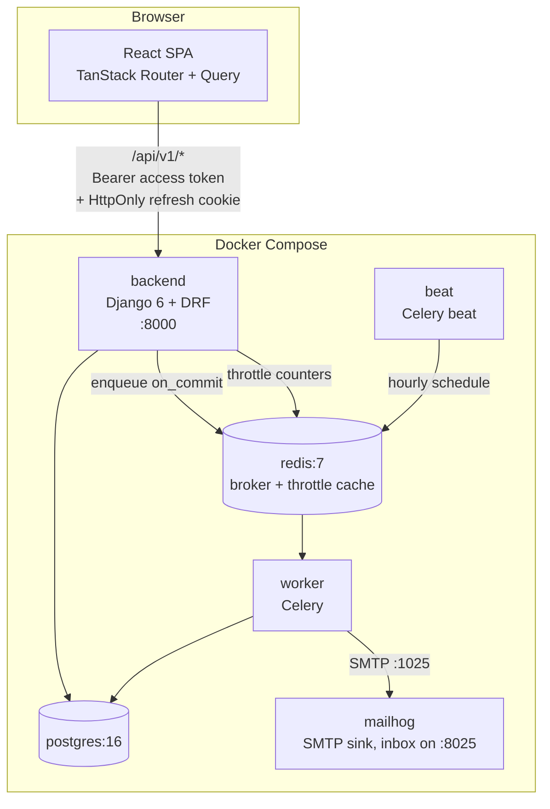
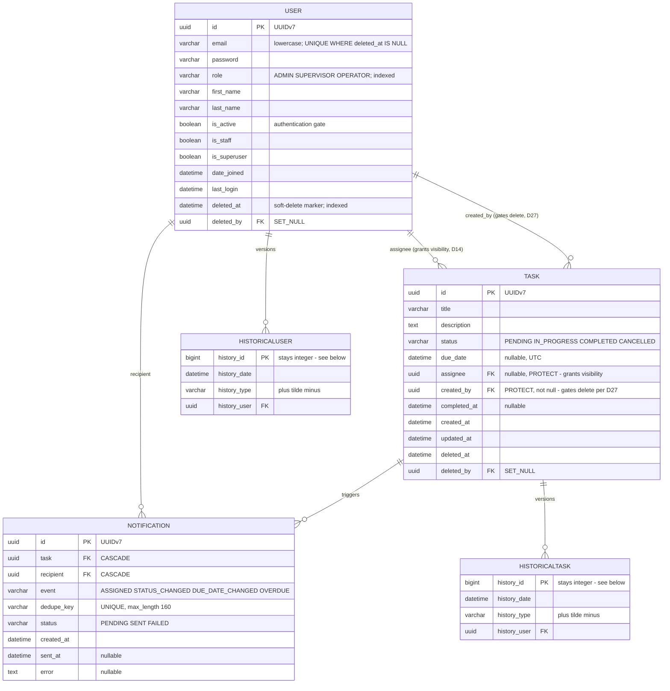
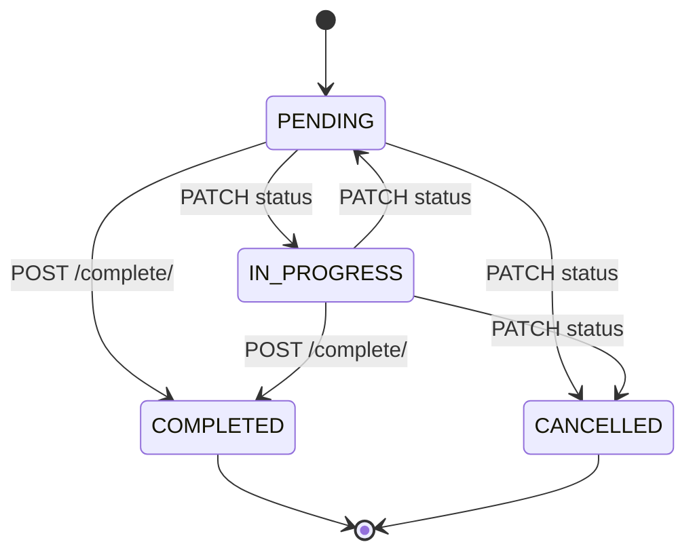
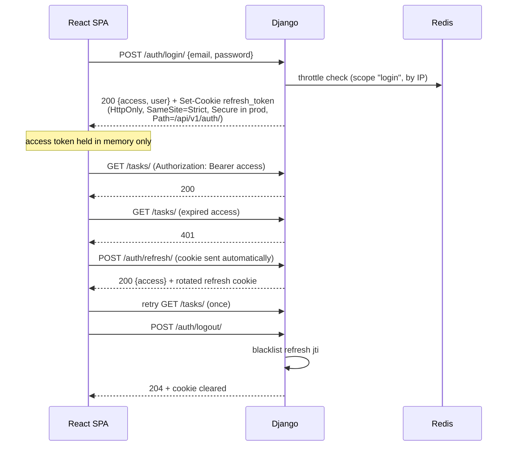
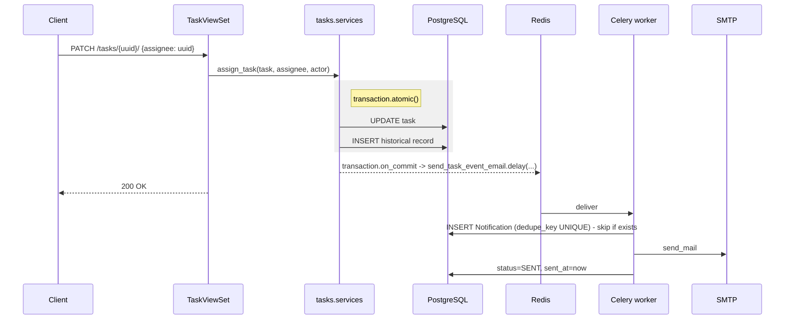

# Task Management System

Role-based task management: a Django 6 / DRF API and a React SPA.
Design spec: `docs/superpowers/specs/2026-10-05-task-management-system-design.md`.

## Quick start

Requires Docker and Docker Compose.

```bash
cp .env.example .env
```

```bash
docker compose up -d
```

```bash
docker compose exec backend python manage.py migrate
```

```bash
docker compose exec backend python manage.py seed_demo_data
```

The API answers on `http://localhost:8000/api/v1/`, the SPA on `http://localhost:5173`,
the interactive API docs on `http://localhost:8000/api/v1/schema/swagger-ui/`, and every
email the stack sends lands in MailHog at `http://localhost:8025`.

`.env` is never committed; `.env.example` is the template and lists every variable the
stack reads.

One wrinkle if you **re-create the database** rather than starting fresh: `celery beat`
keeps its last-run state in `backend/celerybeat-schedule` (gitignored), which lives in the
bind mount and therefore survives `docker compose down -v`. Beat then considers the hourly
sweep overdue and fires it immediately on startup — before you have run `migrate` — and the
worker logs one `relation "tasks_task" does not exist`. It is harmless: the sweep runs again
on the hour against the migrated schema. To avoid the noise entirely, migrate before the
worker and beat start:

```bash
docker compose up -d db redis backend
```

```bash
docker compose exec backend python manage.py migrate
```

```bash
docker compose up -d
```

### Working on the frontend

Compose runs the SPA, but **the recommended edit loop is native**:

```bash
cd frontend
```

```bash
npm install
```

```bash
npm run dev
```

Vite's HMR is noticeably faster against the native filesystem than through a bind-mounted
`node_modules`, especially on Windows, where every file-watch event crosses the container
boundary. The Compose `frontend` service exists so `docker compose up` brings the whole
stack up for a reviewer who just wants to see it run; the anonymous `node_modules` volume
is what stops the bind mount shadowing the container's own install.

**Install must run from inside `frontend/`.** On npm 10.9, none of
`npm --prefix frontend install`, `npm install --prefix frontend` or `npm install -C frontend`
works — each changes where packages land but not where `package.json` is read from, so all
three fail looking for one at the repository root. Running a *script* that way is fine
(`npm run --prefix frontend test`), and CI sidesteps the question with
`defaults.run.working-directory`.

## Running the checks

The backend suite runs in the Compose stack by default, falling back to a local `uv`
environment when the `backend` container is not running. This is also what the `pre-push`
hook runs:

```bash
bash scripts/run-backend-tests.sh
```

It reports which environment the suite passed in. Inside the container the script forces
`DJANGO_SETTINGS_MODULE=config.settings.test`, because `.env` sets the local settings module
there and pytest-django lets that environment variable override `pyproject.toml`.

The other backend commands run against `backend/` through uv's `--directory` flag, so each is
a single uncompounded command. Outside the container `DJANGO_SETTINGS_MODULE` comes from
`backend/pyproject.toml`, so a local run needs no settings variable.

```bash
uv sync --directory backend
```

```bash
uv run --directory backend ruff check .
```

```bash
uv run --directory backend ruff format --check .
```

```bash
uv run --directory backend mypy
```

```bash
uv run --directory backend pytest -q
```

The test settings use **Postgres, not SQLite** — the schema depends on partial indexes
and a check constraint that SQLite does not exercise the same way. `docker compose up -d db`
provides one, published on host port **5442**, with the credentials from `.env.example`. A
local run reads `POSTGRES_*` from the shell, never from `.env`, so without an override it
targets `localhost:5432` — point it at Compose's database instead:

```bash
POSTGRES_PORT=5442 uv run --directory backend pytest -q
```

`pytest` carries `--cov=apps --cov-report=term-missing --cov-fail-under=80` in `addopts`,
so every full-suite run — a local run, the pre-push script and CI's `backend` job — applies
the same gate rather than two thresholds that can drift. Only `compat`'s one-module smoke
step opts out, with `--no-cov`. The suite currently sits at 100% of `apps/`; 80 is a floor,
not a target.

Frontend checks run from `frontend/`:

```bash
npm run typecheck
```

```bash
npm run lint
```

```bash
npm run test
```

There is no numeric coverage gate on the frontend, but `tsc --noEmit` must pass, and the
Vitest setup turns **any unexpected `console.error` or `console.warn` into a test failure**
— so "no console noise" is enforced rather than reviewed. A test that deliberately renders
an error state opts out for one specific message with `allowConsole(/…/)`.

Lint and format locally exactly as CI does, via the pinned hooks:

```bash
pre-commit install --install-hooks
```

```bash
pre-commit install --hook-type pre-push
```

```bash
pre-commit run --all-files
```

`.pre-commit-config.yaml` pins the same ruff version that `uv.lock` resolves, so a local
hook and CI cannot disagree. The pytest hook runs on **pre-push**, not pre-commit, so
committing stays fast while nothing broken reaches the remote.

## Demo credentials

One command populates the database with representative data, so filtering, pagination, the
overdue sweep and the dashboard all have subjects on the first run — there is no need to
create users and tasks by hand before evaluating anything.

```bash
docker compose exec backend python manage.py seed_demo_data
```

| Email | Role | Name |
|---|---|---|
| `admin@demo.local` | Admin | Ada Admin |
| `supervisor@demo.local` | Supervisor | Sam Supervisor |
| `operator@demo.local` | Operator | Omar Operator |
| `operator2@demo.local` | Operator | Olga Operator |
| `operator3@demo.local` | Operator | Otto Operator |

The password for every demo account is **`DemoPass!2026`**.

Three Operators exist because one would make the assignee picker and the "reassign" flows
untestable. The seed creates **45 tasks**, which is more than two pages at the default page
size of 20, so pagination is visible immediately. Statuses cycle through all four, and due
dates deliberately straddle "now" — some days overdue, some within the next seven days,
some far future, some with no deadline at all — so the `overdue` filter, the
`due_next_7_days` tile and the hourly sweep each have matching rows straight away.

The command is **idempotent** (running it twice changes nothing) and **refuses to run under
production settings**, so demo credentials cannot be seeded into a production-like profile.

### Seeding more data

```bash
docker compose exec backend python manage.py seed_demo_data --users 25 --tasks 300
```

| Flag | Default | Meaning |
|---|---|---|
| `--users N` | `0` | Add N randomly-named users **on top of** the five fixed accounts |
| `--tasks M` | `45` | Ensure at least M tasks exist |

Both flags are **top-up**: re-running with the same numbers changes nothing, raising one adds
the difference, and neither deletes anything. A run therefore also refills tasks that were
deleted since the last one, up to M.

Generated users get `user{n}@demo.local`, numbered from 1, with random names; about one in
four is a Supervisor, the rest Operators. Their names are random by design, so you find them
by signing in as **`admin@demo.local`** and browsing **Users** — every demo account shares the
password above. The index, not the name, carries uniqueness: the embedded name lists are
finite, so an email built from a name would collide and silently create fewer users than you
asked for.

The command creates the fixed accounts when they are missing, but never modifies an existing
one. If you deactivate `admin@demo.local` while trying out user management, re-seeding will
not reactivate it — reactivate it from another Admin account, or reset the database with
`docker compose down -v`.

Tasks are assigned at random across every non-Admin user, and `created_by` is randomised too —
so some tasks end up Operator-created, which is what makes the "an Operator may delete only a
task they created" rule (D27) visible in the UI.

Rows are created one at a time rather than with `bulk_create`, because `bulk_create` skips the
`django-simple-history` records the audit trail depends on. Large values are therefore slow.

## Architecture

The five diagrams below are copied from the design spec, which is their source of truth.
Each was rendered with `@mermaid-js/mermaid-cli` to confirm it parses.

### Containers

Seven Compose services. `beat` is a documented override of root `AGENTS.md` — the brief
requires scheduled overdue notifications, and Celery documents `worker -B` as
development-only.



### Data model

Every primary key is a UUIDv7 (D28). `Task`'s two user foreign keys are `PROTECT`
because nothing is ever hard-deleted; `Notification`'s are `CASCADE`, since it is an
append-only log that should go with a row if one ever *is* removed in data repair.



### Task status transitions

`COMPLETED` is reachable only through `POST /tasks/{id}/complete/` (D18), which is what
guarantees `completed_at` is always set alongside it. `COMPLETED` and `CANCELLED` are
terminal (D19), and a database check constraint ties the timestamp to the status.



### Authentication flow

The access token lives only in frontend memory; the refresh token is only ever an
HttpOnly cookie scoped to `/api/v1/auth/`, and never appears in a JSON body.



### Notification dispatch

Enqueued through `transaction.on_commit`, so a worker can never read a row that has not
committed yet, and made idempotent by a unique dedupe key derived from the
`django-simple-history` record id.



### The capability matrix

The authoritative, machine-readable version is `apps/core/permissions/matrix.py`. This table
mirrors it — and `apps/core/tests/test_permission_matrix_api.py` drives a parametrized
request against **every cell**, reading the same data `RolePermission` reads at request
time, so the rules and their enforcement cannot drift apart. A matrix row added without a
corresponding request definition fails a test rather than going silently untested.

| Endpoint | Admin | Supervisor | Operator | Unauthenticated |
|---|---|---|---|---|
| `POST /auth/login/` | allowed | allowed | allowed | allowed |
| `POST /auth/refresh/` | allowed | allowed | allowed | allowed (cookie) |
| `POST /auth/logout/` | allowed | allowed | allowed | 401 |
| `GET /users/me/` | allowed (minimal) | allowed (minimal) | allowed (minimal) | 401 |
| `GET /users/` | allowed (full) | **allowed (read-only, minimal)** | **403** | 401 |
| `POST /users/` | allowed | **403** | **403** | 401 |
| `GET /users/{id}/` | allowed (full) | allowed (minimal) | **403** | 401 |
| `PATCH /users/{id}/` | allowed | **403** | **403** | 401 |
| `DELETE /users/{id}/` | allowed (soft) | **403** | **403** | 401 |
| `GET /tasks/` | **403** | allowed (all) | allowed (`assignee = me`) | 401 |
| `POST /tasks/` | **403** | allowed (any valid assignee) | allowed (**self-assigned only**) | 401 |
| `GET /tasks/{id}/` | **403** | allowed | own, else **404** | 401 |
| `PATCH /tasks/{id}/` | **403** | allowed (incl. `assignee`) | own, **`assignee` immutable** | 401 |
| `DELETE /tasks/{id}/` | **403** | allowed (soft) | **only if `created_by = me` too** (soft), else **403** | 401 |
| `POST /tasks/{id}/complete/` | **403** | allowed | own | 401 |
| `GET /tasks/stats/` | **403** | allowed (global) | allowed (own) | 401 |

Three consequences worth stating outright, because each is unusual:

1. **An Admin has no task surface whatsoever** — every `/tasks/*` route is 403, `stats/`
   included. An Admin therefore has no dashboard at all; their landing page is user
   management. Account administration and operational data stay separated.
2. **A Supervisor's user access is a different serializer, not a flag.** The minimal shape
   exposes `id`, `email`, `first_name`, `last_name`, `role` — enough for an assignee picker
   and to show who holds a task. `is_active`, `is_staff`, `date_joined` and `last_login`
   stay Admin-only, and write methods are refused at the permission layer before
   serialization ever happens.
3. **403 vs 404 is role-dependent and deliberate.** An Admin hitting `/tasks/{id}/` gets
   **403** — the role has no business with that resource type. An Operator hitting another
   Operator's task gets **404** — the type is theirs, that instance is not, and 403 would
   confirm the row exists. Because this falls out of queryset scoping, list and detail
   cannot disagree.

### Layering, and how the dependency direction is enforced

Requests flow **views → serializers → services → repositories**, with selectors owning
reusable reads. A service never touches the ORM; a repository never holds a workflow;
neither knows about `request` or HTTP status codes.

D8a makes the dependency rule structural rather than conventional: each repository is a
`@runtime_checkable` `Protocol` whose members are all `@abstractmethod`, implementations
inherit it explicitly, and **the DRF viewset is the composition root** — the only place a
concrete `Django*Repository` is ever named. So `services.py` imports `TaskRepository` and
never `DjangoTaskRepository`, and a reviewer can verify the rule by reading the imports.

`apps/core/tests/test_layering.py` asserts it instead of trusting it: the service modules
name no `Django*Repository`, contain no `.objects.` manager access, and the views do name
the concrete classes. The ORM check is a coarse text scan, chosen deliberately — it is
cheap, has no false negatives for the pattern that matters, and the alternative is an
import-graph dependency for one rule.

Why `Protocol` rather than a plain `ABC`, given the explicit inheritance and
`@abstractmethod` make it look like one: a test fake conforms **without inheriting**, so
`test_the_test_fake_conforms_to_the_same_protocol` catches a fake drifting from a signature
the production repository no longer has — which nothing else would catch.

## Key implementation decisions

Every decision at a glance; the sections below expand the ones whose reasoning is
load-bearing. Full rationale for all of them is in the design spec's decision log (§3).

| # | Decision | Why |
|---|---|---|
| D1 | Django `>=6.0,<6.1` | The newest Django *every* dependency tests against; two of them stop at 6.0. |
| D2 | Python `>=3.14` as a hard floor | `uuid.uuid7()` entered the stdlib in 3.14 (D28); anything lower needs a third-party package. |
| D3 | simplejwt from a pinned git commit | PyPI 5.5.1 predates Django 6.0 support. Outside Dependabot — carries an exit criterion. |
| D4 | drf-spectacular over drf-yasg | drf-yasg caps at Django 5.2 and emits OpenAPI 2.0 only. |
| D5 | uv with a committed `uv.lock` | Required by the brief; reproducible resolution including the git source. |
| D6 | No `django-safedelete` | Soft delete is ~40 owned lines and needs our own tests regardless. |
| D7 | No charting library | The dashboard is six numbers; stat tiles and a CSS bar suffice. |
| D8 | Views → serializers → services → repositories, plus selectors | The project's documented architecture, applied consistently rather than per feature. |
| D8a | Repositories are `Protocol`s; the viewset is the composition root | Makes the dependency rule structural — the import graph enforces it. |
| D9 | Serializers never persist; write serializers are plain `Serializer`s | Removes the second write path rather than forbidding it by convention. |
| D10 | A shared `apps/core/`, every module named for one responsibility | A shared app is unavoidable; a `utils.py` dumping ground is not. |
| D11 | The permission matrix is declarative data | One table read by both the permission class and a parametrized suite, so they cannot drift. |
| D12 | No `django-guardian` | The rules are role-derived, not per-object. |
| D13 | Strict role separation; **Admin has no task surface at all** | The brief's literal reading; account administration stays separate from the work. |
| D14 | Operator visibility is `assignee = me` only | Reassignment revokes access immediately. `created_by` grants no visibility. |
| D15 | An Operator may update and complete an assigned task, but not reassign it | Handing work off belongs to a Supervisor. |
| D16 | An Operator's new task is always self-assigned | Omitting `assignee` defaults to self; supplying someone else is a 400, not a silent coercion. |
| D17 | An assignee is never an Admin | Assigning to one would create a task nobody can open. Not expressible as a check constraint. |
| D18 | `POST /tasks/{id}/complete/` is the only path to `COMPLETED` | One audited transition, so `completed_at` is always set with it. |
| D19 | `COMPLETED` and `CANCELLED` are terminal | A simpler invariant that matches the database constraint. |
| D20 | Soft delete on `User` and `Task`; `Notification` exempt | Needed for a meaningful audit trail. The log is append-only, so a marker there would always be null. |
| D21 | A soft-deleted user's email becomes reusable | A partial unique index, not a plain unique constraint. |
| D22 | `is_active` and `deleted_at` are not synonyms | One is the auth gate, the other the delete marker; an Admin may deactivate without deleting. |
| D23 | `due_date` is a nullable `DateTimeField` | The hourly sweep compares against a time of day; a task may have no deadline. |
| D24 | Email stored lowercase in a plain `EmailField` | Case-insensitive uniqueness without the `citext` extension. |
| D25 | Both task FKs are `PROTECT` | Nothing is hard-deleted; if it ever is, fail loudly rather than null an audit record. |
| D26 | Notification recipients are gated by current read access | Never email someone about a task they would get a 404 on. |
| D27 | An Operator may delete only a task they **created** | Closes an accepted risk: no restore endpoint means a wrong delete is irrecoverable. |
| D28 | All primary keys are UUIDv7 | Removes enumeration while keeping index locality close to a sequential integer's. |

### D1 — Django `>=6.0,<6.1`, not 6.1

6.0 is the newest Django that *every* dependency actually tests against. DRF 3.18.1,
django-simple-history 3.13.0 and django-filter 26.2 cover both 6.0 and 6.1, but
simplejwt@master and drf-spectacular 0.30.0 stop at 6.0. Pinning 6.0 leaves zero untested
combinations while still satisfying the "Django 6+" requirement.

Trade-off, stated plainly: 6.0 left mainstream support when 6.1 shipped (Aug 2026), so it
is a security-fix-only branch. The exit criterion is D3's.

### D2 — Python `>=3.14` is a hard floor, not a preference

`uuid.uuid7()` entered the standard library in 3.14 (D28), so anything lower would need a
third-party UUIDv7 package. Django 6.0 officially supports 3.12–3.14.

Most of the dependency set is not individually verified against 3.14. The guard is the
`compat` CI job rather than a claim: `uv sync` fails outright if any dependency caps below
3.14, and it ran on day one before anything was built on the stack. It resolved cleanly on
Python 3.14.3 with Django 6.0.9, so the documented fallback — Python 3.13 plus the
`uuid-utils` package — was not needed.

### D3 — simplejwt from git, pinned to one commit

PyPI's 5.5.1 (Jul 2025) predates PR #959 ("add django 6.0 and python 3.14 support", merged
Feb 2026), which adds the Django 6.0 test matrix and replaces deprecated `pkg_resources`
with `importlib.metadata`. Master supports Django 6.0; the release does not. The pin is
commit `a7cb077ea0809f78cc6a99cb6825ab7594eae627`.

Consequences, all real:

- The backend image installs `git` so uv can resolve the git source.
- `uv.lock` captures the SHA, so builds stay reproducible (it resolves to
  `5.5.1.post36+ga7cb077ea`).
- **`pip-audit` and Dependabot cannot track a git pin**, so this one dependency sits
  outside automated advisory coverage.
- **Exit criterion:** revert to the PyPI package as soon as a simplejwt release containing
  #959 ships, then relax D1 toward Django 6.1.

### D4 — drf-spectacular 0.30.0 instead of drf-yasg

drf-yasg 1.21.17 still caps its classifiers at Django 5.2 and emits OpenAPI 2.0 only.
drf-spectacular classifies Django 6.0, emits OpenAPI 3.0.3/3.1/3.2, and is actively
maintained. `backend §35` permits either tool. This overrides the original brief's
nomination of drf-yasg, and costs nothing to anyone expecting Swagger — drf-spectacular
serves a Swagger UI at `/api/v1/schema/swagger-ui/` alongside ReDoc.

### The `compat` CI job, and when to delete it

CI runs four jobs: `lint`, `compat`, `backend` and `frontend`. Three of them ask "is my code
right?"; **`compat` asks whether this dependency set still assembles and boots at all**, and
it exists only because of the unusual combination D1–D4 chose. It has three stages:

1. Resolve the pinned set including the git source, assert Python ≥ 3.14 with a working
   `uuid.uuid7()`, assert Django is 6.0.x, import the two at-risk packages, and boot Django.
2. Run the login round-trip, which is the single most load-bearing claim in D3 — that the
   git-pinned simplejwt actually issues and verifies a token on Django 6.0. It runs with
   `--no-cov`: it is a smoke test of one module, and the 80% gate is a whole-suite
   measurement that belongs to the `backend` job.
3. Generate and validate the OpenAPI document, which is the equivalent claim for D4.

This job is **deliberately temporary and risk-specific**. When a simplejwt release
containing PR #959 ships, D3's exit criterion is taken, D1 relaxes toward Django 6.1, and
**this job can be deleted** — its whole purpose is to keep an assumption under continuous
verification until the assumption is no longer needed.

The generated `schema.yaml` is **gitignored**: it is a build artifact, and committing it
would create a second source of truth that silently goes stale.

### D5 — uv as package manager

`pyproject.toml` plus a committed `uv.lock`. Required by the brief; `backend §44a` permits
uv or Poetry, used consistently.

### D10 — a shared `apps/core/` app, with every module named for one responsibility

A shared app is unavoidable: the soft-delete base model, pagination, the exception handler
and the permission matrix belong to no single feature. `backend §49` forbids `utils.py`,
`common.py` and `helpers.py` dumping grounds, so the rule is satisfied not by avoiding a
shared app but by refusing to give it a catch-all module. Each file owns one thing:
`models.py` the abstract bases, `managers.py` the soft-delete manager, `roles.py` the role
choices, `pagination.py`, `ordering.py`, `throttling.py`, `constants.py`, `exceptions.py`,
and `permissions/` the matrix and the classes that read it.

`Role` lives in `core` rather than in `users` for a structural reason: the permission
matrix needs it, and a shared app importing a feature app inverts the dependency direction
that D10 exists to protect.

### D11 — the permission matrix is declarative data

`apps/core/permissions/matrix.py` maps `(resource, action)` to the set of roles that may
reach it. One table is read by two consumers — `RolePermission` at request time and a
parametrized test suite — so the rules and their enforcement cannot drift apart.

What it buys concretely: D13's strongest claim, that **an Admin has no task surface at
all**, is asserted against the data itself before any view exists, and it stays asserted
for every task action that is ever added. Lookups fail closed — `MATRIX.get(key,
frozenset())` means a new viewset action with no matrix row is denied rather than silently
allowed.

Its scope is deliberately narrow: endpoint reachability only. The one object-level rule
(D27, an Operator may delete only a task they created) lives in `IsTaskCreator`, not in the
matrix, because encoding one row-dependent outcome would require a richer value type for
every other row.

### D20, D21, D22 — soft delete, and why `is_active` survives alongside `deleted_at`

Every domain model (`User`, `Task`) is soft-deleted: deletion is a state change, never a
row removal, which is what makes the `django-simple-history` audit trail worth having.
There is no restore endpoint, and soft-deleted rows are invisible to the entire API —
enforced by making the filtering manager the *default* manager, so no viewset needs its own
`deleted_at` filter. That removes the single most likely place for a data leak.

`Notification` is the deliberate exception (D20): it is an append-only log that no API
exposes and no user deletes, so a `deleted_at` column on it would never be anything but
null.

**D21 — a soft-deleted user's email becomes reusable.** This is why `email` is *not*
`unique=True`. Uniqueness is a partial index, `UNIQUE(email) WHERE deleted_at IS NULL`, so
deleting `sam@example.com` frees the address while the audit row keeps it.

**D22 — `is_active` and `deleted_at` are not synonyms.** `is_active` is Django's
authentication gate; `deleted_at` is the soft-delete marker. Soft deletion sets both, so a
deleted user cannot log in, but an Admin may deactivate a user *without* deleting them.

Two subtleties that are easy to get wrong and are pinned by tests:

- `Meta.default_manager_name = "objects"` is set explicitly on `User`. Manager order under
  multiple inheritance is not reliable, and `ModelBackend` authenticates through
  `User._default_manager.get_by_natural_key()` — if that ever resolved to the unfiltered
  manager, **a soft-deleted user could still log in**.
- `Meta.base_manager_name` is deliberately *not* set, so related-object descriptors and
  `PROTECT` keep seeing deleted rows and behave predictably.

### The token flow — access in memory, refresh in an HttpOnly cookie

Lifetimes: access **15 minutes**, refresh **7 days**.

- The **access token lives only in frontend memory** — never `localStorage` or
  `sessionStorage`, so an XSS payload cannot read it back out of storage.
- The **refresh token is only ever an HttpOnly cookie** and never appears in a JSON body.
  `POST /auth/login/` returns `{access, user}`; the refresh token leaves only as
  `Set-Cookie`. A test asserts the body has no `refresh` key, because that is the kind of
  thing a refactor reintroduces quietly.
- The cookie is scoped `Path=/api/v1/auth/`, so the browser attaches it to the refresh and
  logout endpoints and to **nothing else** — ordinary API requests never carry it.
- `ROTATE_REFRESH_TOKENS` and `BLACKLIST_AFTER_ROTATION` are both on, so a refresh issues a
  new token and blacklists the old one. Replaying a rotated token is a 401, and logout
  genuinely revokes rather than just clearing the cookie client-side. Both are tested.
- `USER_ID_FIELD = "id"` carries a **UUID string** in the claim, so nothing downstream may
  assume an integer id (D28).

The login payload also carries the current user, so the SPA can pick a landing page from
its role in one round trip instead of two.

### Rate limiting, and why the throttle cache is Redis

| Scope | Rate | Applies to |
|---|---|---|
| `login` | **5/min**, keyed by IP | `POST /auth/login/` — brute-force defence on the most-attacked endpoint |
| `refresh` | 30/min | `POST /auth/refresh/` |
| `anon` | 20/min | any other unauthenticated request |
| `user` | 120/min | authenticated traffic |

Rates are centralised in `DEFAULT_THROTTLE_RATES`. The login and refresh throttles subclass
`AnonRateThrottle` so the key is the **client IP** — an unauthenticated login attempt has no
user to key on.

**The throttle cache is Redis, not `LocMemCache`, and that is not incidental.**
`LocMemCache` is per-process, so each gunicorn worker would keep a private counter and the
effective limit would silently become `rate × worker_count` — a limit that does not hold
while appearing to. Redis is already in the stack for Celery, so this costs no new service.
A dedicated `throttle` cache alias keeps the counters out of any future application cache.

In **tests only**, the throttle alias is locmem, so throttle tests need no Redis service.
A `conftest.py` autouse fixture clears both cache aliases around every test: a `LocMemCache`
lives for the whole pytest process, so an uncleared anon counter otherwise leaks across
modules and surfaces as a mystery 429 somewhere unrelated.

Exceeding a limit returns **429** with a `Retry-After` header. Failed logins are logged with
IP and email — never the password.

### D24 — email stored lowercase in a plain `EmailField`

Case-insensitive uniqueness without requiring the Postgres `citext` extension and its
migration. Normalization happens in `UserManager` and again in the serializer, so both the
API and `createsuperuser` go through it.

### The `Task` invariants that live in the database

**`completed_at` and `status` cannot disagree.** A `CheckConstraint` asserts that
`status = COMPLETED` implies `completed_at IS NOT NULL`, and any other status implies
`completed_at IS NULL`. The database is the final boundary deliberately: this holds even
against a direct ORM write, the Django admin, or a data migration — not just against the
API. Both directions are tested.

**D18 — `POST /tasks/{id}/complete/` is the only path to `COMPLETED`.** `PATCH
status=COMPLETED` is a 400. One audited path for the transition is what guarantees
`completed_at` is always set alongside it. The `TRANSITIONS` map encodes this by omitting
`COMPLETED` from *every* set of reachable statuses, and a test asserts that omission rather
than trusting the table to be read correctly.

**D19 — `COMPLETED` and `CANCELLED` are terminal.** Both map to an empty transition set.
Reopening is a documented future extension, not a current requirement.

**D23 — `due_date` is a nullable `DateTimeField`**, not a `DateField`: the overdue sweep
compares against `timezone.now()` and needs a time of day. Nullable because a task may
legitimately have no deadline — and `due_date__lt` excludes nulls automatically, which is
the behaviour the overdue query wants.

**D25 — both task FKs are `on_delete=PROTECT`.** Nothing is ever hard-deleted, so this
should never fire; if it does, it must fail loudly rather than silently null an audit
record.

**D17 is deliberately *not* a database constraint.** "An assignee must be a Supervisor or
Operator, never an Admin" is a cross-table assertion and not expressible as a
`CheckConstraint`, so it is enforced in the serializer *and* re-checked in the service, with
tests at both levels.

### Notifications: who gets told, and when

| Event | Trigger | Recipients |
|---|---|---|
| `ASSIGNED` | a task gains an assignee | the new assignee |
| `DUE_DATE_CHANGED` | `due_date` changes | the assignee |
| `STATUS_CHANGED` | the status changes, completion included | the assignee **and** the creator |
| `OVERDUE` | the hourly sweep finds a past-due open task | the assignee **and** the creator |

Title and description edits are **intentionally silent** — they are not worth an email, and
a test asserts that a title-only PATCH enqueues nothing.

Two filters then apply to every event, in this order:

1. **The read-access gate (D26).** A recipient must currently be able to read the task. An
   Operator who created a task but no longer holds it is **dropped** — emailing someone
   about a task they would get a 404 on is confusing and leaks information. A Supervisor
   creator is kept, because Supervisors see every task. An Admin creator is also dropped
   (defensively: the API forbids it, but the Django admin and seed data do not, and an
   Admin can read no task at all under D13). This falls straight out of D14.
2. **Actor suppression.** Nobody is emailed about their own action. The overdue sweep has
   no actor, so it suppresses nobody.

Both are pure functions over ids and roles in `apps/notifications/services.py`, so the
rules are unit-tested with no database, no broker and no email backend.

### The three notification failure modes, and how each is handled

These are the parts most likely to be got wrong, so each is named and tested.

**1. Enqueueing inside a transaction.** Calling `.delay()` inside `transaction.atomic()`
can deliver the message to a worker *before* the transaction commits — the worker then
reads a row that does not exist yet, or a pre-update version. So every enqueue goes through
`transaction.on_commit`, and services enqueue while views never do. The guard is a test
that rolls the surrounding transaction back and asserts nothing was sent; a later
contributor adding a bare `.delay()` would break that test and nothing else.

`functools.partial` is used rather than a lambda for the callback, because a lambda in a
loop captures by reference and every callback would fire with the last iteration's values.

**2. Retries double-sending.** Delivery is made idempotent by a unique `dedupe_key`
derived from the `django-simple-history` record id:
`{task_id}:{segment}:{recipient_id}:{history_id}`. Tying the key to the audited change
means the *next* genuine change is a new email while a retry of the same one is not.
`NotificationRepository.create_if_absent` owns the whole mechanism, including the
`IntegrityError` catch — wrapped in its own inner `atomic()` block, because otherwise the
violation marks the outer transaction broken and every later query raises
`TransactionManagementError` somewhere unrelated.

One refinement of the spec here, worth stating because it changes behaviour: returning
`None` for *any* existing key would make `autoretry_for` dead code, since the first attempt
always inserts the row before sending. So `create_if_absent` returns `None` only when an
existing row is already `SENT`, and returns the existing row when a previous attempt did
not complete — the retry can then finish the job. One email per key still holds.

`OVERDUE` keys on the **date** instead of a history id, because there is no change to
anchor to. The cadence and the dedupe window are deliberately different granularities:
the sweep runs **hourly** so a task going overdue at 09:15 is emailed by 10:00, while the
date in the key caps delivery at **one email per task per recipient per day**. Running the
sweep twice in a day therefore sends nothing the second time, which is tested.

The sweep reads `overdue_candidates()` — a selector, not the ORM — which returns
`values_list(...).iterator()`, so a large backlog never materialises as model instances,
and it is served by the `("status", "due_date")` partial index. That selector joins
`created_by__role` specifically so the D26 read-access gate applies to the sweep as well
as to the API path: there is no model instance to read the role from, and without it an
Operator creator who no longer holds the task would be emailed.

The schedule is one fixed `crontab(minute=0)` entry in `config/celery.py`.
**django-celery-beat is deliberately not used** — a database-backed editable schedule would
mean another dependency plus migrations for a schedule nobody needs to edit at runtime.

**3. Blind retries.** `autoretry_for` lists `SMTPException` and `ConnectionError` only —
transport failures, which are worth retrying. A bare `Exception` is **never** retried; a
test asserts `Exception not in autoretry_for`. The ordering in the send task is what makes
this work: a transport failure re-raises *before* `mark_failed`, so the row stays `PENDING`
and `create_if_absent` hands it back on the retry; an unexpected failure marks the row
`FAILED` and returns, so Celery does not retry a bug. Nothing is swallowed — there is no
`except Exception: pass` anywhere.

### D27 — an Operator may delete only a task they created

An Operator can read, update and complete any task **assigned** to them, but may delete one
only if they **created** it as well. Deleting an assigned task they did not create is a
**403**.

This closed a previously accepted risk. Without it an Operator could soft-delete
Supervisor-assigned work, and since D20 provides no restore endpoint, that work would be
irrecoverable through the API. An Operator can still decline work by other means — change
the status, or ask a Supervisor — but cannot make someone else's task disappear. A
Supervisor retains delete on every task.

Two structural points worth keeping straight:

- **Queryset scoping cannot express this rule.** The row must stay *visible* while becoming
  *undeletable*, which is exactly what object-level permissions are for. So `IsTaskCreator`
  is applied to the `destroy` action only, and a test asserts read, update and complete
  stay unaffected — delete is narrower than read, not a general loss of access.
- **This is the only rule in the design where `created_by` affects authorization**, which
  is why D14 is explicit that `created_by` is not merely an audit column even though it
  grants no visibility.

### Why that refusal is 403 and not 404

Elsewhere the API withholds existence: a task outside your scope is a 404, because
answering 403 would confirm that a task with that id exists. Here nothing is being
withheld — the task is *already* in the Operator's queryset and they can `GET` it. So a 404
would be a lie about a row the client can already see, and 403 is the honest answer.

The code is `delete_requires_creator`, and `IsTaskCreator` **raises**
`PermissionDenied(code=...)` rather than returning `False` — returning `False` would yield
DRF's generic `permission_denied` code and lose the distinction the frontend branches on.

### Indexing: every index is partial, and `created_by` has none

All task indexes carry `WHERE deleted_at IS NULL`, so they cover only live rows — the only
rows the API can see.

**There is no index on `created_by`**, even though D27 makes it load-bearing for
authorization. The check is `task.created_by_id == user.id` against a row the request has
*already* fetched, so no `WHERE created_by = ...` query is ever issued. `backend §30` asks
for evidence before an index, and there is none to point at. If a "created by" **filter**
is ever added, the index arrives with it.

`is_overdue` is a Python property computed from loaded data, so serializing it costs no
query; filtering by it uses the equivalent database `Q()` in `TaskFilterSet`. A test asserts
it never became a model field.

### D28 — UUIDv7 primary keys

All primary keys are UUIDv7 via `uuid.uuid7()` from the Python 3.14 standard library (D2),
so it costs no dependency. Non-sequential ids remove resource enumeration from the API
surface, while UUIDv7's 48-bit big-endian timestamp prefix keeps inserts append-ordered —
B-tree index locality stays close to a sequential integer's instead of fragmenting the way
UUIDv4 would.

The ordering property is the entire point, and it is the one thing a functional test would
*not* catch: a silent fall-back to `uuid4` would keep every id unique and every other test
green, losing only index locality. `test_generated_ids_sort_in_creation_order` exists for
exactly that. Note the caveat: CPython's 42-bit counter orders ids minted in the same
millisecond **by the same process**; across processes, ordering is millisecond-granular.

### List state lives in the URL (D45–D56)

Both lists keep their filters, sort, page and page size in the URL. The URL is the only copy:
each page derives its API query from the route's search params and writes every change back
with `navigate`. Refresh, Back/Forward, a shared link and a dashboard card all therefore land
on the same view. Before, the task list read the URL once and then kept a private copy, so
the URL went stale after the first filter.

- **Validated in one place.** `src/app/search-params.ts` drops anything a list cannot use: a
  page that is not a positive integer, a page size outside 10/20/50/100, an unknown role.
  `stripSearchParams` keeps page 1 and size 20 out of URLs, so one view has one URL.
- **Edits replace, page moves push.** Back undoes navigation, not each checkbox. Every replace
  passes `resetScroll: false`, because the router otherwise scrolls to the top even on a replace.
- **Typed text goes through a 300 ms draft.** The router commits search changes in a React
  transition after an async load. A controlled input bound straight to a search param is
  therefore reverted by React and then jumps. The Search box and the date inputs keep a local
  draft and commit once typing pauses, which also means one request per pause, not per
  keystroke.
- **The pager is numbered and driven by `count`:** first, last, and the current page ±2. The
  previous page stays on screen while the next loads (`keepPreviousData`), so a click never
  unmounts the pager or drops keyboard focus. A page that no longer exists, such as a stale
  link or the last row of the last page deleted, returns to page 1 instead of showing an error.

### Page titles (D57, D58)

Every route declares its tab title with the router's `head` option, as "Tasks · Task
Management System", page name first so it survives a narrow tab. `<HeadContent />` in the root
route renders it. `index.html` deliberately has no `<title>`: React 19 hoists the route's title
into `<head>` after any static one, and the browser shows the first.

### Fixes from the browser check (D59–D63)

A Playwright pass over the running app found five problems that the jsdom test suite could
not see. Each fix has a test that failed first.

- **The Compose frontend served stale code (D59).** A Docker bind mount on Windows (and often
  macOS) does not deliver file-change events into the container, so after a `git pull` or a
  branch switch Vite kept serving its cached modules — the merged dashboard rendered as the old
  one until the container restarted. The Compose service sets `DEV_SERVER_POLLING=true`, which
  turns on Vite's polling watcher; a native `npm run dev` keeps native file events.
- **Dialogs did not take focus (D60).** Focus stayed on the button that opened the delete or
  deactivate dialog, outside the `aria-modal` dialog, so a keyboard user tabbed through the whole
  page to reach Cancel, and Escape did nothing. A shared `useModalDialog` hook focuses Cancel
  (the safe default for a destructive action), closes on Escape unless a request is in flight,
  keeps Tab inside the dialog, and returns focus to the opener when it still exists.
- **The assignee picker stopped at 100 users (D61).** It paged `/users/` at its 100-row cap and
  filtered Admins out in the browser, so with more users everyone past the first page was
  unassignable, and D17 was re-derived on the client. `GET /users/assignable/` (Supervisor only)
  returns the assignable set with the minimal fields a Supervisor already sees. The picker offers
  exactly what it reports — the same "report the rule, don't re-derive it" approach as
  `can_delete` and `allowed_transitions`. It first returned the whole set unpaginated; D64
  replaced that with search and paging.
- **Link-styled buttons took two Tab stops (D62).** Seven places wrapped a `<Button>` in a
  router `<Link>` — a `<button>` inside an `<a>`, which is invalid HTML and two Tab stops for one
  control. `ButtonLink` is one element with the button's look; a source-scan test fails if the
  nesting comes back.
- **Deleting from a task's page refetched it (D63).** Invalidating the `["tasks"]` prefix also
  refetched the deleted task's own detail query — a guaranteed 404, logged just before
  navigating to `/tasks`. The detail query is now removed before the rest is invalidated.

### The assignee picker searches as you type (D64)

D61's unpaginated list sent every assignable user (about 500 in the seeded data) to every
Supervisor who opened a task form, and a native `<select>` of hundreds of names is hard to use.
`GET /users/assignable/` is now paged like every other list (20 per page, `page_size` up to 100)
and takes `?search=` over email, first name and last name — the same fields as `/users/`.
D17 is applied before the search, so a search only narrows the set and can never surface an
Admin.

The picker is an ARIA combobox (the WAI-ARIA "combobox with listbox popup" pattern), written
for this project rather than taken from a library: there is one consumer, and the stack has no
UI component library to fit it into.

- Nothing is fetched until the list first opens. Typing searches the server once per 300 ms
  pause, and the current options stay on screen until the new answer arrives.
- More users load when the arrow keys reach the last loaded one, when the list is scrolled to
  its end, or from "Load more". The footer says how many of the total are shown.
- Focus never leaves the input. The active option is announced through
  `aria-activedescendant`, and mouse presses inside the popup do not blur the input.
- Escape, or leaving the field without choosing, puts back the chosen assignee's name. After
  typing, Enter chooses nothing until an arrow key makes an option active, so a stale result
  is never picked by accident.
- The form holds the chosen user, not just an id, so a task whose assignee is past the first
  page still shows their name without fetching anything.

### "No assignee" and "not yours to choose" are different (D65)

The API reads an omitted `assignee` as "leave it alone" (on update) or "assign it to me" (an
Operator's create, D16), and an explicit `null` as "unassign" (D32). The task form used `null`
for both meanings, which broke two things:

- **A Supervisor could not unassign a task.** The edit page dropped a `null` assignee, so
  choosing "Unassigned" saved the old assignee.
- **An Operator could not create a task at all.** The create page sent `assignee: null`, which
  the API refuses from an Operator with `400 assignee_immutable`.

The form now leaves `assignee` out when the actor may not choose one, and sends `null` only
when "Unassigned" was chosen.

### Fixes from the QA report (D66–D78)

A browser QA pass (`docs/qa/2026-10-07-frontend-qa-report.md`) found fourteen issues; the
design is `docs/superpowers/specs/2026-10-07-qa-fixes-iteration-5-design.md`. Each fix has a
test that failed first.

- **An Admin cannot act on their own account (D66).**
  - Deleting yourself is refused by an object permission, `IsNotSelf`: **403
    `cannot_delete_self`**, the same layer and shape as D27's `delete_requires_creator`.
  - Changing your own role, or deactivating yourself, is refused by the service: **400
    `cannot_change_own_access`**, a field-level refusal like `assignee_immutable`. The service
    compares against the current values rather than testing for presence, because the edit
    page always sends both fields.
  - The UI hides Deactivate on your own row and shows your role read-only.
  - Two Admins can still remove each other; see Accepted risks.
- **The task table shows its sort (D67, D68).** One sort model, `features/tasks/sorting.ts`,
  serves the headers, the mobile select and URL validation. The default, newest first, is
  marked like any other order. Headers carry `aria-sort` and a ▲/▼ glyph; each sort button's
  accessible name is just its visible label, and `aria-sort` alone announces the state, as in
  the WAI-ARIA APG sortable-table pattern. (Review amended this: the first version named the
  action each button would take.)
- **Phones and tablets can sort, and get cards below `lg` (D69).** At `md` the table's six
  columns did not fit, so badges and actions wrapped. This departs from design spec §11.6's
  "below `md`" for the task table only; the users table keeps `md`.
- **Back to tasks returns to the same list (D70).** List links leave the list's search in the
  router's history state; detail, edit and create forward it, validated like a URL. A deep
  link falls back to the plain list, and so does a task opened in a new tab (Ctrl or middle
  click), because a new tab starts with no history state.
- **Not-found pages explain and lead back (D71, D72).** A shared `NotFoundPanel`, rendered by
  the root route's `notFoundComponent` (`AppNotFound`) with `notFoundMode: "root"`, so both
  unmatched paths and any thrown `notFound()` render once, at the root, inside the app frame
  when signed in. Signed out, the page uses the sign-in page's centred frame, and because child
  guards do not run in root mode, a signed-out `/tasks/a/b` shows it instead of redirecting.
  (Review moved this from the router's `defaultNotFoundComponent`.) A task 404 never says
  whether the task was deleted or is someone else's.
- **Unknown statuses and orderings are dropped from the URL (D73).**
- **No route loads while auth is still loading (D74).** `router.invalidate()` loads, and a
  load before the session was known mounted the page and fetched its data before the
  redirect. The test harness had copied the effect by hand; both now share
  `useRouterAuthSync`, in its own module `src/app/useRouterAuthSync.ts`. Callers must not
  render `RouterProvider` until auth has settled.
- **Focus moves to the first error after a failed submit (D75).** This covers the forms and
  also the two delete dialogs: after a failed delete the dialog focuses its error. A jsdom-only
  probe had missed that real browsers drop focus to `<body>` when the focused button becomes
  disabled, so the dialog focus trap (`useModalDialog`) now also pulls focus back into the
  dialog from a non-tabbable element or `<body>`, and keeps Tab inside while every control is
  disabled. A validation error naming a field the form does not render now shows as the
  form-level message.
- **Due dates show as the UTC day the form edits, with no time (D76).** A seeded due date
  carrying a real time shows its UTC day.
- **The current menu item is marked, and header targets are 44 px (D77).**
- **An impossible date range is explained, not hidden (D78).** The explanation is an
  always-mounted polite live region described by both date inputs, so it is announced whichever
  field caused the inversion. A single-day range (after equals before) is valid.

## Deliberate overrides of AGENTS.md

| Override | AGENTS.md says | This project does | Why |
|---|---|---|---|
| **Celery beat service** | root § Local Development: "Do not add further services beyond this (a beat/scheduler process, Flower, extra queues, Kafka)" | Adds a `beat` service to `docker-compose.yml` | The brief requires scheduled overdue notifications, which needs a periodic scheduler. A separate `celery beat` process is the standard, production-shaped arrangement; Celery documents `worker -B` as development-only. |
| **API docs tool** | `backend §35` names `drf-yasg` first | Uses `drf-spectacular` | D4. `§35` explicitly permits either. |
| **Dockerfile dependency install** | root § Local Development example uses `requirements.txt` + `pip` | Uses `uv sync` from `pyproject.toml`/`uv.lock`, and installs `git` | D5 (required by the brief) and D3. `backend §44a` already mandates `pyproject.toml` over `requirements*.txt`, so the root example is the outdated part. |
| **A fourth kind of state** | frontend §4: three kinds of state — server state in TanStack Query, shared client state in Context, local UI state in `useState` | List view state (filters, sort, page, page size) lives in the URL, owned by the router | A list's view must survive refresh, Back and a shared link, and the dashboard's cards must be able to open it. Only the URL does all four. Typed text keeps a short-lived local draft (D50), which is §4's local UI state. |

## Known limitations and exit criteria

### Accepted risks

These are known and deliberate, not oversights. Each is listed with what could be done
about it, so the next person decides rather than rediscovers.

| Risk | Detail | Mitigation available |
|---|---|---|
| **No recovery path for a soft-deleted row** | D20 provides no restore endpoint, so a deletion is irrecoverable through the API and recoverable only at the database level. D27 keeps the blast radius small: an Operator can only delete tasks they created, so the worst case is someone destroying their own work. A Supervisor can delete any task. | A Supervisor-only restore endpoint: one view plus one matrix row, since `all_objects` already exposes deleted rows. |
| **A UUIDv7 is not a secret** | A cold guess faces roughly 2^73, but a *sibling* id minted in the same millisecond by the same process is far weaker, since the counter advances by increment. An id must never be treated as a capability token. | None needed — no authorization anywhere depends on id secrecy, and the matrix suite proves it. |
| **A `User` id discloses `date_joined`** | UUIDv7's timestamp prefix is readable by anyone holding the id. Harmless for `Task`, whose `created_at` is already public, but the minimal user serializer exposes `id` while deliberately withholding `date_joined` — so anyone who can see a nested `assignee` can recover that user's account-creation time. A real if minor widening of a boundary. **Accepted.** | Key `User` on UUIDv4 and keep v7 elsewhere: `User` is low-insert-rate so it gains little from v7, and both store identically as Postgres `uuid` — a one-line default change, no migration. Not done because D28 asks for v7 on all ids. |
| **Two dependencies are untested above Django 6.0** | simplejwt@master's tox matrix and drf-spectacular's classifiers both stop at 6.0, which is why D1 pins 6.0. | The `compat` job verifies the combination on every push. |
| **Python 3.14 support is verified for only part of the stack** | Only simplejwt and drf-spectacular were checked package-by-package; DRF, django-simple-history, django-filter, Celery, psycopg and factory_boy were not. | `compat` stage 1 runs `uv sync`, which fails outright if anything caps below 3.14 — a resolution error, not a subtle runtime bug. It resolved cleanly. |
| **A git-pinned dependency sits outside advisory tooling** | `pip-audit` and Dependabot cannot track a git SHA, and this is the **authentication** library. | The D3 exit criterion below; `compat` signals when a PyPI release can replace it. |
| **Django 6.0 is a security-fix-only branch** | 6.0 left mainstream support when 6.1 shipped (Aug 2026). | The same exit criterion. |
| **Two Admins can remove each other** | D66 stops an Admin acting on their own account, but a "last active Admin" rule was declined: one Admin can deactivate another, who could have done the same. With no restore endpoint (D20), recovering from zero Admins needs shell access (`createsuperuser`). | A service check that refuses to deactivate, delete or demote the last active Admin, under a row lock so two concurrent requests cannot both pass it. |

### Exit criteria

| Limitation | Exit criterion |
|---|---|
| simplejwt is a git pin, outside Dependabot and `pip-audit` coverage (D3) | A simplejwt release containing PR #959 ships; move back to PyPI and relax D1 toward Django 6.1. |
| Django 6.0 is a security-fix-only branch (D1) | Same as above — D1 is gated on D3. |
| `ruff format` rewrites Python code blocks embedded in Markdown, which would edit the read-only `AGENTS.md` briefs | `AGENTS.md` is in `extend-exclude` in `backend/pyproject.toml`. Remove it only if ruff gains a narrower setting for embedded code. |
| **`auth.E003` is silenced** in `SILENCED_SYSTEM_CHECKS` — see below | Django's `Options.total_unique_constraints` learns to count partial constraints. Until then the check cannot be satisfied, only silenced. |
| **The SPA and the API must be deployed same-site** — see below | Serve both from one registrable domain (the recommendation), or move to `SameSite=Lax`/`None` and add explicit CSRF token validation on `/api/v1/auth/refresh/` and `/logout/`. |
| ~~drf-spectacular generator warnings~~ — **resolved.** `get_serializer_class()` and `get_queryset()` now tolerate the request-less schema pass, and the hand-written actions carry `@extend_schema`. `spectacular --validate` reports 0 warnings and 0 errors. | — |

### What you should see in the browser console

An anonymous visit to `/login` makes **one** failed request:

```
POST /api/v1/auth/refresh/  401
```

That is correct, not a bug. The access token lives in memory only, so on every load the client
asks whether the refresh cookie can restore a session; for a visitor who has never signed in,
the answer is no. Returning 200 for "no session" would contradict the status the API's own
permission tests assert. A returning user whose cookie is still valid sees no failed request
at all. (In development, React's `StrictMode` runs the bootstrap twice; the refresh is
deduplicated, so it is still made once.)

**Two things that look like application errors and are not:**

- `MaxListenersExceededWarning: Possible EventEmitter memory leak` and
  `ObjectMultiplex - orphaned data for stream "app-init-liveness"`, from a
  `chrome-extension://...` origin, come from the **MetaMask** extension's content script
  talking to itself. They appear on any page in a browser profile that has it installed, and
  no change to this codebase affects them.
- A `500` from `POST /api/v1/auth/login/`, with `relation "users_user" does not exist` in the
  backend log, means `migrate` has not run against this database yet:

  ```bash
  docker compose exec backend python manage.py migrate
  ```

  This is the same startup-ordering sharp edge that affects `celery beat` on a fresh database.

### Why the SPA and the API must be same-site

The refresh cookie is `SameSite=Strict`, which is the **primary CSRF defence** for the two
cookie-authenticated endpoints: a cross-site request does not carry the cookie at all.

Locally this coexists with CORS only because of a distinction that is easy to miss:
`localhost:5173` and `localhost:8000` differ by port, which CORS treats as cross-*origin*
but `SameSite` does not treat as cross-*site* — ports are not part of a site. So CORS must
be configured (and is, explicitly) while the cookie still flows.

A deployment that puts the SPA and the API on different **registrable domains** would
silently stop sending the refresh cookie, and refresh would fail with no CORS error to
explain it. That is the failure mode worth knowing about in advance.

### Why `auth.E003` is silenced

This is a security-adjacent check, so it should not be discovered later by reading
settings. `auth.E003` requires `USERNAME_FIELD` to carry a **total** unique constraint, and
Django's `Options.total_unique_constraints` deliberately excludes partial ones. D21 needs
the email constraint to be partial (`WHERE deleted_at IS NULL`) so a deleted user's address
becomes reusable — so the check is unsatisfiable by construction, not merely inconvenient.

The guarantee it would have given is not abandoned, it is relocated to a test:
`test_two_live_users_cannot_share_an_email` asserts the `IntegrityError` against real
Postgres, and `test_a_soft_deleted_users_email_becomes_reusable` asserts the other half.
A plain `unique=True` would satisfy the checker and break the requirement.

## GenAI prompt and validation record

`docs-external/PROMPT-LOGS.md` holds the verbatim prompts. This section records what the
generated output got **wrong**, because that is the part worth knowing.

Four prompts produced this repository: a brainstorming prompt, a spec review that corrected
three decisions, a planning prompt, and one execution prompt. The plan carried the code,
the commands and the expected output for 53 tasks, which made the failures informative:
where reality disagreed with the plan, it disagreed specifically.

**The plan's largest bet was correct.** D2 assumed the whole dependency set would resolve on
Python 3.14 with Django 6.0. It did, first try — including the git-pinned simplejwt. Neither
documented fallback (Python 3.13 plus `uuid-utils`, or ruff `target-version = "py313"`) was
needed, and the four query-count guards hit their predicted numbers with no adjustment.

**Six claims were wrong and were corrected against the real toolchain:**

- **A plan comment asserted a bug that does not exist.** It justified writing the
  `overdue=false` filter positively by claiming `.exclude()` would "silently drop every
  undated task". That is true of raw SQL but not of Django, which injects
  `AND due_date IS NOT NULL` inside the negated group. Verified by running the naive version
  against the suite — all tests still passed. The positive form was kept for readability and
  the comment rewritten to say so.
- **The task list's delete control was unimplementable as specified.** The list was asked to
  hide delete for an Operator's non-created tasks, while the list serializer deliberately
  omits `created_by`. Resolved by extracting D27 into one `may_delete_task()` predicate read
  by both the permission class and the serializers, surfaced as `can_delete` — computed from
  a local column, so the query counts did not change.
- **The dashboard's drill-through links pointed nowhere.** The list held its filters in local
  state only, so the links would have navigated and then been ignored. The route now
  validates search params and the list seeds from them.
- **The API client refreshed after a failed login.** It excluded only `/auth/refresh/` from
  refresh-and-retry, so a wrong password triggered a pointless refresh whose error replaced
  the server's message and tripped the session-expired handler.
- **Deleting the placeholder dispatcher broke a test the plan did not mention**, leaving an
  orphaned import in the concurrency test.
- **Three toolchain assumptions were stale**: the current Vite template ships Vite 8,
  TypeScript 6 and oxlint rather than Vite 7 and eslint; Vitest config needs
  `vitest/config`'s `defineConfig`; and `npm --prefix` no longer redirects where
  `package.json` is read, so the planned `npm --prefix frontend ci` would have failed in CI.

**Two assertions in the plan were weaker than they looked**, and were strengthened rather
than trusted: the single-flight refresh test and the `select_for_update` concurrency test
were each verified to **fail** when the mechanism they guard was removed (`expected 5 to
be 1`, and both threads completing). A guard that cannot fail is decoration — the coverage
gate was checked the same way.

**One environment difference is worth recording** for anyone writing similar tests: Django
creates Postgres foreign keys as `DEFERRABLE INITIALLY DEFERRED`, so a bad-FK insert does
not raise until `COMMIT`. Inside a test transaction that means teardown, long after the code
under test returned.

**List navigation.** The spec review caught five claims that would have failed at
implementation:
- the router resets scroll on `replace` navigations too, unless told not to;
- a date picked and then cleared within the debounce would have reappeared;
- the spec's own snippets passed an optional page into a required prop and did not typecheck;
- `useNavigate` given the route id rather than its path logs a warning that the console guard
  fails on;
- a `className="px-3"` override cannot beat `Button`'s `px-4`, because classes are merged with
  plain `clsx`.

The plan review applied the whole plan to a scratch copy before any of it was executed. That
caught two tests that found a task title twice — jsdom renders both the table and the mobile
cards — and a middleware constant shared by two routes that did not typecheck. Execution then
followed the plan without correction; the only adaptation was keeping iteration 3's delete
dialog, which had landed in `TaskListPage` in the meantime.

The request's own example pager, "1, 3, 5 (current), 7, 10", read two ways. The project owner
chose a contiguous window over literal steps of two.

**QA fixes (iteration 5).** A Playwright pass produced the QA report; brainstorming turned it
into a spec, and a spec review caught four claims that would have failed at implementation:

- a not-found component wrapped in the app frame would have rendered a **second** header for
  `/tasks/a/b`, because TanStack's default "fuzzy" not-found mode renders it inside the shell;
- the bootstrap regression test would have exercised the test harness's **hand copy** of the
  effect, not the app's;
- the URL whitelist commit needed a module the next commit created;
- the timezone test's example input did not cross midnight, so the bug it targeted would have
  passed it.

Root causes were confirmed in the installed router source (`invalidate()` ends in `load()`)
rather than assumed.

Code review during execution then changed three more decisions: D68's button names, D71's
not-found owner, and D75's dialog focus. The last was found by a real-browser check, because
jsdom cannot reproduce the focus drop.
