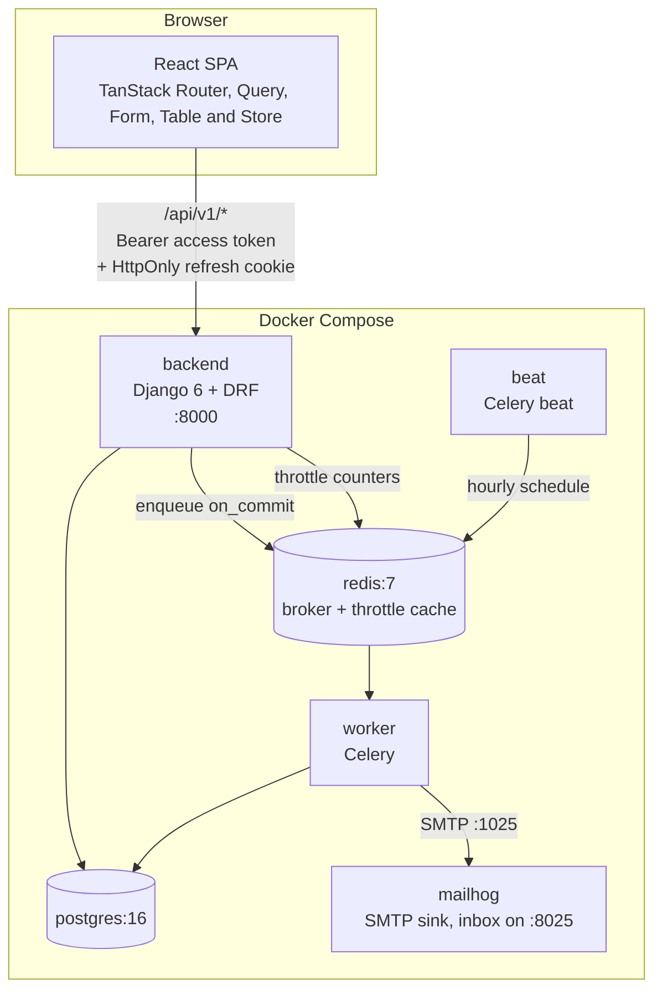
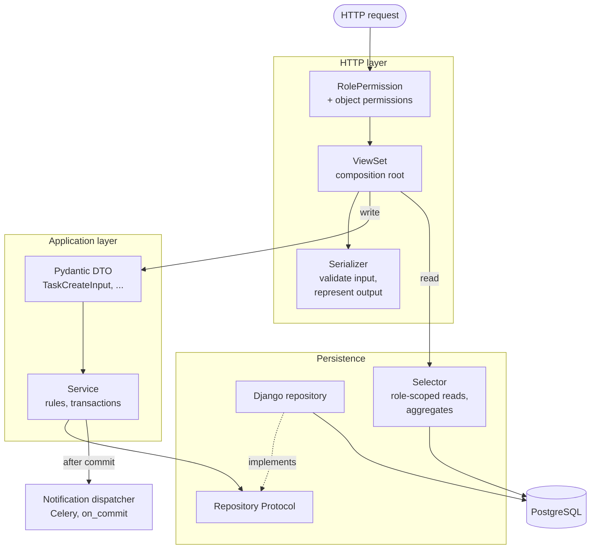
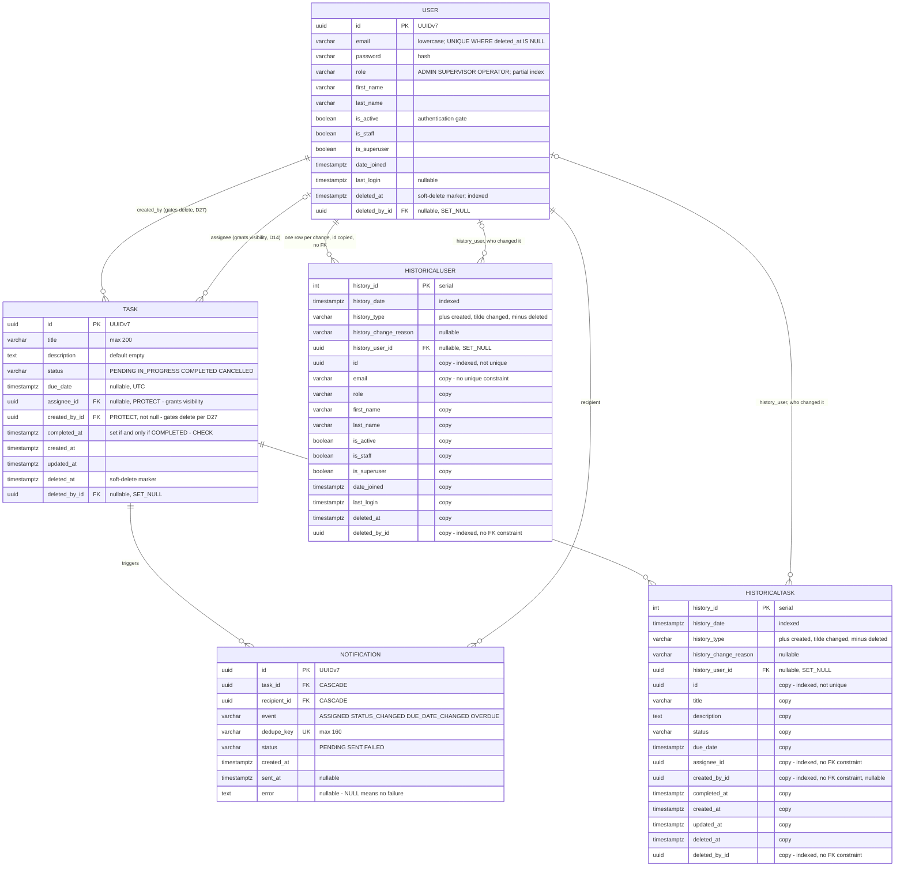
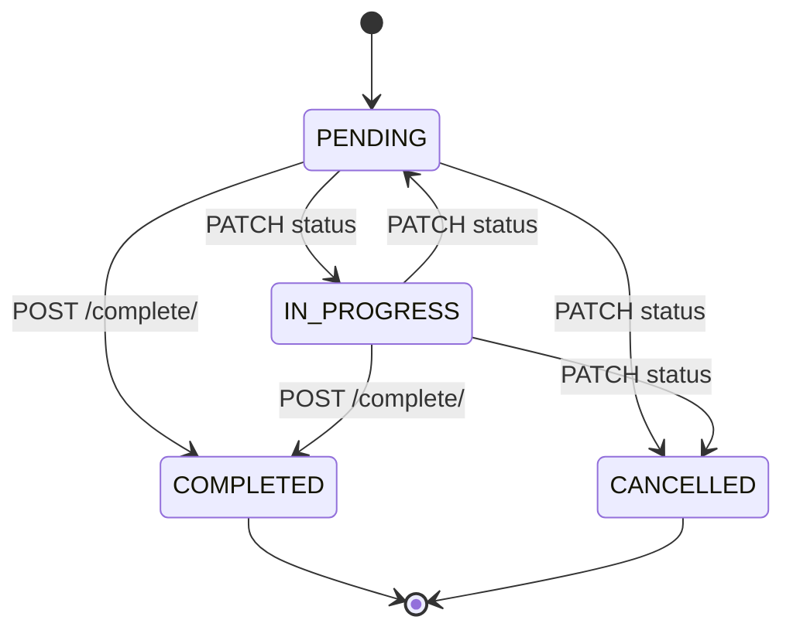
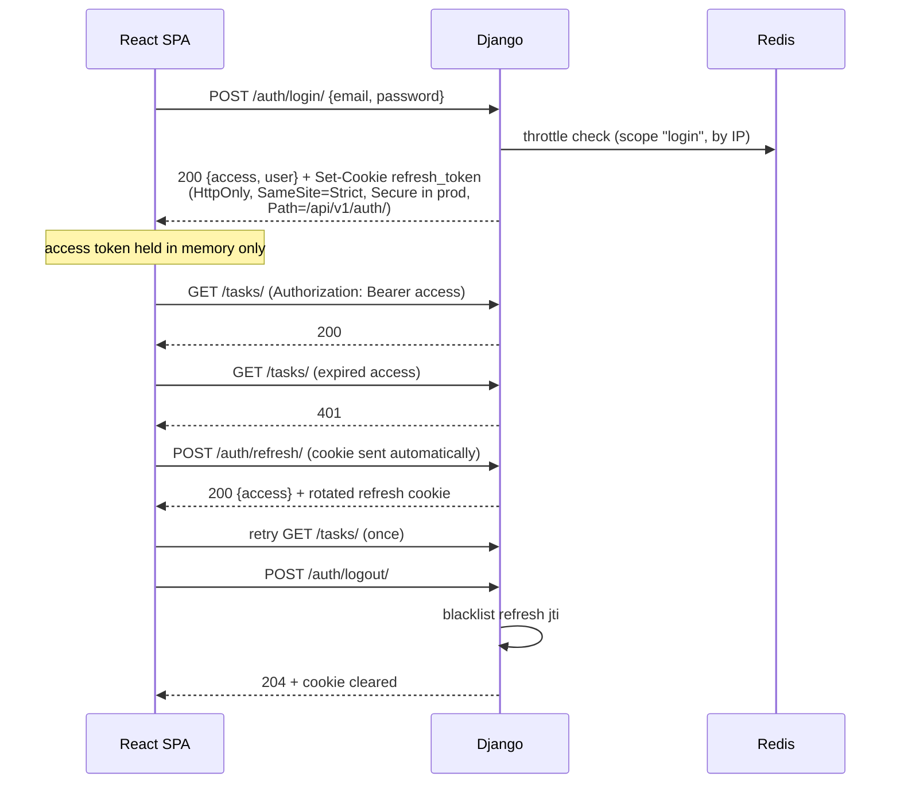
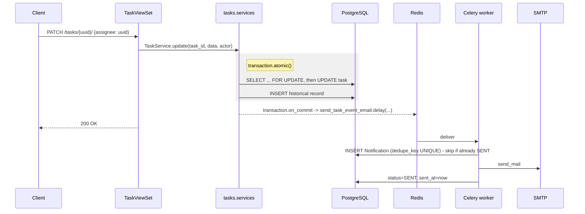
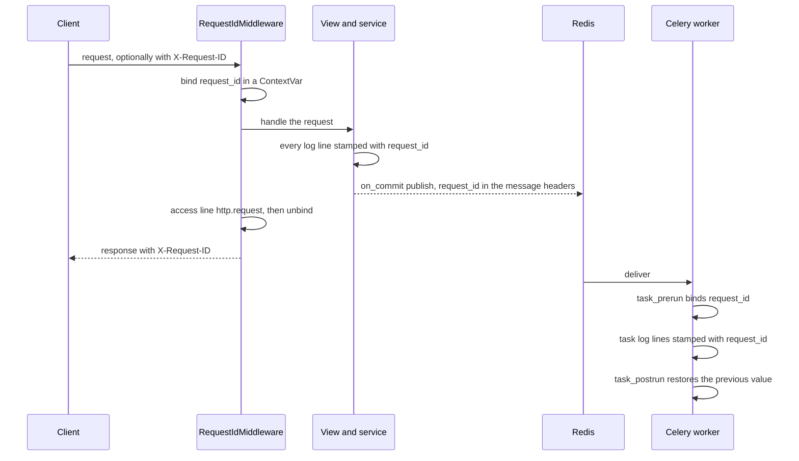
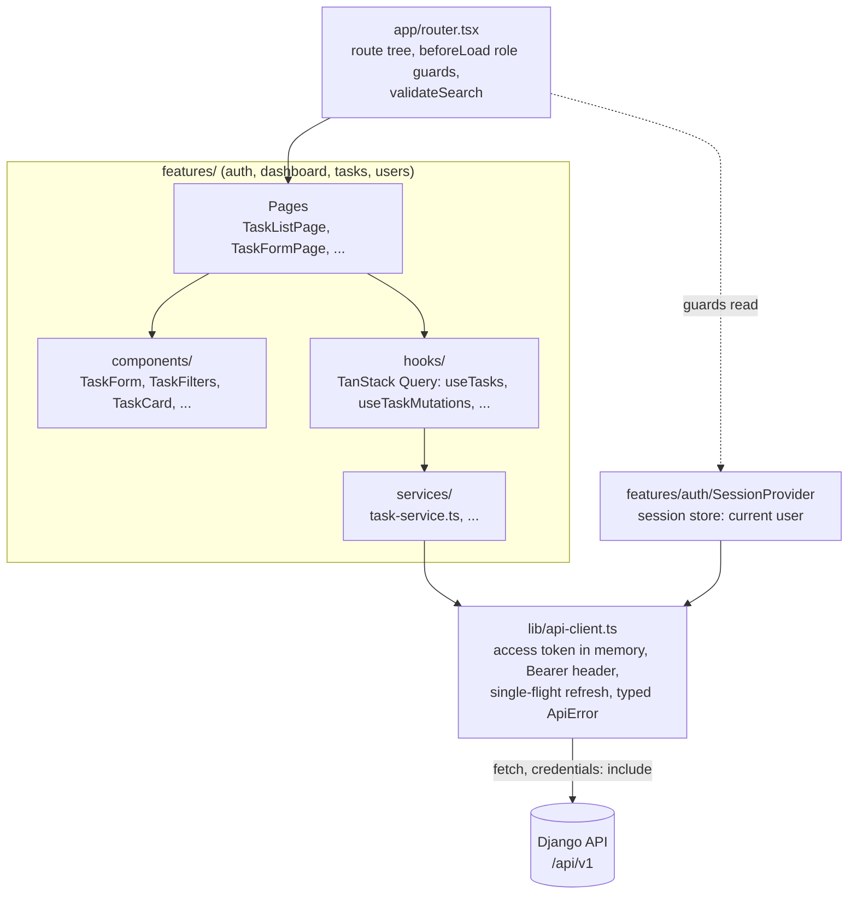

# Architecture

How the system is put together: the containers, the backend layers, the database schema, the
main flows and the frontend structure. These diagrams describe the system **as built**.

They began as copies of the [design spec](superpowers/specs/2026-10-05-task-management-system-design.md)'s
diagrams. Since then, the data model was redrawn from the live schema, and the layering and frontend
diagrams are new. Where this document and the spec differ, this document is current. The *why*
behind each element is in [TECHNICAL-DECISIONS.md](TECHNICAL-DECISIONS.md), referenced by number
(D1–D94).

## Containers

Seven Compose services. `beat` and `mailhog` are documented overrides of root `AGENTS.md`'s
service list:
- `beat`: the brief requires scheduled overdue notifications, and Celery documents `worker -B` as
  development-only;
- `mailhog`: notification email can be read locally without a real mail server.



The `frontend` service (Vite dev server on `:5173`) serves the SPA; it is left out of the diagram
because it only serves files to the browser.

## Backend layers

Requests flow **views → serializers → services → repositories**, with selectors owning reusable
reads (D8). A service never touches the ORM; a repository never holds a workflow; neither knows
about `request` or HTTP status codes.



- **Write path:** the serializer validates, the view turns `validated_data` into a typed DTO
  (D29), and the service applies the business rules inside `transaction.atomic()` through a
  repository. It enqueues notifications only after the commit.
- **Read path:** reads bypass the service, because there is nothing to orchestrate. The view's
  queryset comes from a selector (`scoped_tasks(user)`), which is where role scoping lives. So the
  list and the detail can never disagree about what a user may see.

D8a makes the dependency rule structural rather than conventional. Each repository is a
`@runtime_checkable` `Protocol` whose members are all `@abstractmethod`; implementations inherit it
explicitly; and **the DRF viewset is the composition root**, the only place a concrete
`Django*Repository` is ever named (`TaskViewSet.get_service()`). So `services.py` imports
`TaskRepository` and never `DjangoTaskRepository`, and a reviewer can verify the rule by reading
the imports.

`apps/core/tests/test_layering.py` asserts this rather than trusting it:

- the service modules name no `Django*Repository`;
- they contain no `.objects.` manager access;
- the views do name the concrete classes.

The ORM check is a coarse text scan, chosen deliberately. It is cheap, it has no false negatives
for the pattern that matters, and the alternative is an import-graph dependency for one rule.

Why `Protocol` rather than a plain `ABC`, given that the explicit inheritance and
`@abstractmethod` make it look like one: a test fake conforms **without inheriting**. So
`test_the_test_fake_conforms_to_the_same_protocol` catches a fake drifting from a signature that
the production repository no longer has, which nothing else would catch.

| Layer | Module per app | Example |
|---|---|---|
| HTTP | `views.py`, `serializers.py`, `filters.py`, `urls.py` | `TaskViewSet`, `TaskCreateSerializer`, `TaskFilterSet` |
| Application | `services.py`, `dto.py`, `exceptions.py` | `TaskService.complete()`, `TaskUpdateInput` |
| Persistence | `repositories.py`, `selectors.py`, `models.py` | `DjangoTaskRepository.get_for_update()`, `scoped_tasks()` |
| Shared | `apps/core/` | the permission matrix, soft-delete base model, error contract, pagination, throttles |
| Background | `apps/notifications/` | `send_task_event_email`, `sweep_overdue_tasks` |

## Data model

Every primary key is a UUIDv7 (D28). `Task`'s two user foreign keys are `PROTECT`, because nothing
is ever hard-deleted (D25). `Notification`'s are `CASCADE`: it is an append-only log that should go
with a row if one ever *is* removed in data repair.

The two history tables are generated by `django-simple-history`. Each one **copies every column of
the table it audits**, then adds five `history_*` columns. In the diagram, copied columns are
commented `copy`, and the history-specific columns come first.



| Entity | Table | One row is |
|---|---|---|
| `USER` | `users_user` | an account; soft-deleted rows stay |
| `TASK` | `tasks_task` | a task; soft-deleted rows stay |
| `NOTIFICATION` | `notifications_notification` | one email to one recipient about one change |
| `HISTORICALUSER` | `users_historicaluser` | the state of a user after one change |
| `HISTORICALTASK` | `tasks_historicaltask` | the state of a task after one change |

### How the history tables relate to their source

- **Same columns, fewer constraints.** A history row is a snapshot, so the source table's
  constraints are dropped on the copy:
  - `id` is indexed but not unique, with one row per version;
  - email uniqueness is not copied;
  - foreign keys become plain indexed UUID columns with no database constraint, and
    `created_by_id` becomes nullable.

  That is why a snapshot survives whatever later happens to the rows it pointed at.
- **One column is deliberately not copied.** `User.password` is excluded
  (`HistoricalRecords(excluded_fields=["password"])`). An audit trail needs to know that a
  password changed, not to keep every hash a user ever had.
- **`history_user_id` is the only real foreign key.** It records who made the change, filled in
  by `HistoryRequestMiddleware`, and is `SET_NULL`.
- **Deletes appear as updates.** Rows are only ever soft-deleted (D20), so a deletion is recorded
  as `history_type = '~'`. The trail stays continuous, and the deleted row's final state is kept.
- **`history_id` is a 32-bit `integer`** (simple-history's `AutoField`). `DEFAULT_AUTO_FIELD`
  does not apply here, so the design spec's "stays a `BigAutoField`" is not what the schema has.
  It is never exposed through the API. It is composed into `Notification.dedupe_key`, which ties
  each email to the exact change that caused it.
- `Notification` is neither historised nor soft-deletable: it is already an append-only record.

### Constraints and indexes

| Table | Constraint or index | Columns | Scope |
|---|---|---|---|
| `tasks_task` | `task_completed_at_matches_status` (CHECK) | `status`, `completed_at` | `COMPLETED` if and only if `completed_at` is set |
| `tasks_task` | `task_status_due_live_idx` | `status, due_date` | live rows: status filter, overdue sweep |
| `tasks_task` | `task_assignee_status_live_idx` | `assignee_id, status` | live rows: an Operator's list |
| `tasks_task` | `task_due_live_idx` | `due_date` | live rows: date range, ordering |
| `tasks_task` | `task_deleted_at_idx` | `deleted_at` | all rows |
| `users_user` | `uniq_active_user_email` (UNIQUE) | `email` | live rows only, so a deleted user's email is reusable (D21) |
| `users_user` | `user_role_live_idx` | `role` | live rows |
| `users_user` | `user_deleted_at_idx` | `deleted_at` | all rows |
| `notifications_notification` | UNIQUE | `dedupe_key` | idempotent delivery |
| every table | Django's default FK index | each foreign-key column | all rows |

Framework tables are not drawn:
- Django's `auth` group and permission links, which come from `PermissionsMixin` and are unused
  by the API;
- simplejwt's `token_blacklist` tables, which make refresh rotation and logout revocable;
- Django's sessions, admin log, content types and migrations.

## Task status transitions

`COMPLETED` is reachable only through `POST /tasks/{id}/complete/` (D18), which is what
guarantees `completed_at` is always set alongside it. `COMPLETED` and `CANCELLED` are terminal
(D19), and a database check constraint ties the timestamp to the status. The API reports each
task's `allowed_transitions`, so the SPA never re-implements this map (D39).



## Authentication flow

The access token lives only in frontend memory; the refresh token is only ever an HttpOnly
cookie scoped to `/api/v1/auth/`, and never appears in a JSON body.



On a page load the SPA has no access token, so it tries a refresh first and only then fetches
the user (D35). Concurrent 401s share one in-flight refresh, because with rotation on, racing
refreshes would log the user out.

## Notification dispatch

Enqueued through `transaction.on_commit`, so a worker can never read a row that has not
committed yet. Made idempotent by a unique dedupe key derived from the `django-simple-history`
record id.



`celery beat` also triggers `sweep_overdue_tasks` every hour. Its dedupe key carries the date,
so each recipient gets at most one overdue email per task per day.

## Request ids in the logs

Every log line is one JSON object carrying the `request_id` of the request that caused it,
including the lines the Celery worker writes for that request (D89–D93).



| Piece | Module | Job |
|---|---|---|
| Context variable | `apps/core/request_context.py` | Holds the id; validates incoming ids; generates UUIDv7 ids |
| Middleware | `apps/core/middleware.py` | Binds the id for the request, echoes it, writes the access line |
| Filter and formatter | `apps/core/log_formatting.py` | Stamps each record with the id; writes it as one JSON line |
| Celery signals | `apps/core/celery_context.py` | Carries the id through the message headers into the worker |
| Configuration | `config/settings/base.py` `LOGGING` | One JSON console handler for every logger; Django's duplicate lines dropped |

## The capability matrix

The authoritative, machine-readable version is `apps/core/permissions/matrix.py`. This table
mirrors it. `apps/core/tests/test_permission_matrix_api.py` drives a parametrized request against
**every cell**, reading the same data that `RolePermission` reads at request time, so the rules
and their enforcement cannot drift apart. A matrix row added without a corresponding request
definition fails a test rather than going silently untested.

| Endpoint | Admin | Supervisor | Operator | Unauthenticated |
|---|---|---|---|---|
| `POST /auth/login/` | allowed | allowed | allowed | allowed |
| `POST /auth/refresh/` | allowed | allowed | allowed | allowed (cookie) |
| `POST /auth/logout/` | allowed | allowed | allowed | 401 |
| `GET /users/me/` | allowed (minimal) | allowed (minimal) | allowed (minimal) | 401 |
| `GET /users/` | allowed (full) | **allowed (read-only, minimal)** | **403** | 401 |
| `GET /users/assignable/` | **403** | allowed (minimal) | **403** | 401 |
| `POST /users/` | allowed | **403** | **403** | 401 |
| `GET /users/{id}/` | allowed (full) | allowed (minimal) | **403** | 401 |
| `PATCH /users/{id}/` | allowed (not own role or active flag, D66) | **403** | **403** | 401 |
| `DELETE /users/{id}/` | allowed (soft; not self, D66) | **403** | **403** | 401 |
| `GET /tasks/` | **403** | allowed (all) | allowed (`assignee = me`) | 401 |
| `POST /tasks/` | **403** | allowed (any valid assignee) | allowed (**self-assigned only**) | 401 |
| `GET /tasks/{id}/` | **403** | allowed | own, else **404** | 401 |
| `PATCH /tasks/{id}/` | **403** | allowed (incl. `assignee`) | own, **`assignee` immutable** | 401 |
| `DELETE /tasks/{id}/` | **403** | allowed (soft) | **only if `created_by = me` too** (soft), else **403** | 401 |
| `POST /tasks/{id}/complete/` | **403** | allowed | own | 401 |
| `GET /tasks/stats/` | **403** | allowed (global) | allowed (own) | 401 |

Three consequences worth stating outright, because each is unusual:

1. **An Admin has no task surface whatsoever.** Every `/tasks/*` route is 403, `stats/`
   included, so an Admin has no dashboard at all; their landing page is user management. Account
   administration and operational data stay separated.
2. **A Supervisor's user access is a different serializer, not a flag.** The minimal shape
   exposes `id`, `email`, `first_name`, `last_name` and `role`: enough for an assignee picker and
   to show who holds a task. `is_active`, `is_staff`, `date_joined` and `last_login` stay
   Admin-only, and write methods are refused at the permission layer before serialization ever
   happens.
3. **403 versus 404 is role-dependent and deliberate.** An Admin hitting `/tasks/{id}/` gets
   **403**: the role has no business with that resource type. An Operator hitting another
   Operator's task gets **404**: the type is theirs but that instance is not, and a 403 would
   confirm that the row exists. Because this falls out of queryset scoping, the list and the
   detail cannot disagree.

Every error, from any layer, has one shape: `{"detail", "code", "errors"}`, produced by
`apps/core/exceptions.py`. The frontend branches on `code`, never on message text.

## Frontend

A React 19 single-page app, organised by feature like the backend's apps. Route guards and
hidden controls are **UX only**; the API enforces every rule regardless (root `AGENTS.md` §4).



Each kind of state has exactly one home:

| Kind | Home | Examples |
|---|---|---|
| Server state | TanStack Query | task list, task detail, user list, stats |
| Session | TanStack Store, one session store from `SessionProvider` (D86) | the signed-in user |
| List view state | the URL, owned by the router (D45) | filters, sort, page, page size |
| Form drafts | TanStack Form (D79, D81) | the sign-in, task and user forms; the filter panels' fields, kept in step with the URL (D82) |
| Table model | TanStack Table, controlled from the URL (D83–D85) | rows, sort display, page count |
| Page UI state | TanStack Store, one store per page or component mount (D87) | the delete dialog's target and error, the busy row, the combobox's open state |
| Access token | `lib/api-client.ts` module memory | never `localStorage` or `sessionStorage` |

| Route | Roles | Screen |
|---|---|---|
| `/login` | public | sign-in |
| `/dashboard` | Supervisor, Operator | statistics, each card linking to the matching task list |
| `/tasks`, `/tasks/new`, `/tasks/:id`, `/tasks/:id/edit` | Supervisor, Operator | task list, create, detail, edit |
| `/users`, `/users/new`, `/users/:id` | Admin | user list, create, edit |

A signed-in user lands on their role's home page: Admin goes to `/users`, and Supervisors and
Operators go to `/dashboard`.

## Source layout

```text
.
├── docker-compose.yml          seven services: db, redis, mailhog, backend, worker, beat, frontend
├── backend/
│   ├── config/                 settings (base, local, test, production), urls, celery
│   └── apps/
│       ├── core/               shared: permission matrix, soft-delete base, errors, pagination, throttles, request ids and logging
│       ├── users/              accounts, JWT cookie auth, seed command
│       ├── tasks/              tasks: views, serializers, DTOs, services, repositories, selectors
│       └── notifications/      Celery email tasks, dedupe, overdue sweep
├── frontend/src/
│   ├── app/                    router, providers, layout shell, URL search validation
│   ├── components/             shared primitives (Button, dialogs' focus trap); form/ (app form and fields); table/ (app table, pager)
│   ├── features/               auth, dashboard, tasks, users
│   ├── lib/                    API client, errors, dates, pagination helpers, URL field sync, store helpers
│   └── test/                   MSW server, render harness, console guard
└── docs/                       architecture, decisions, GenAI workflow, QA report, specs, plans
```
