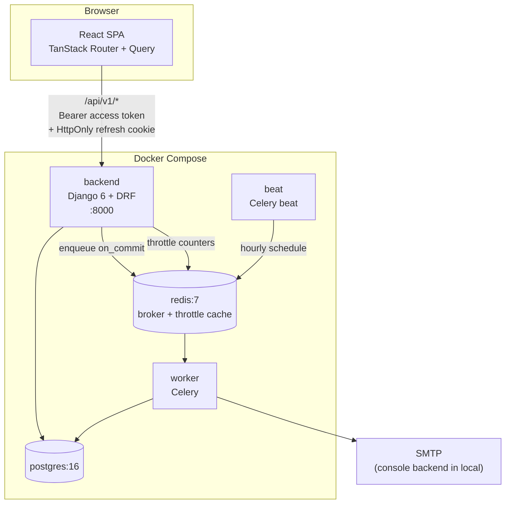
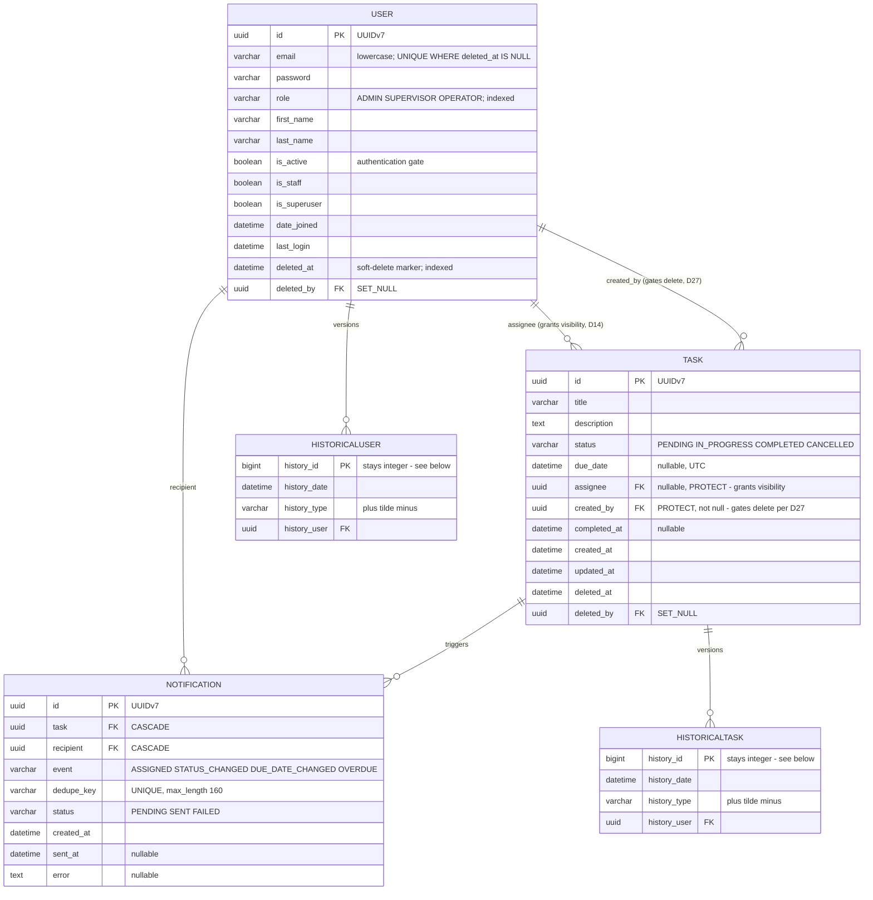
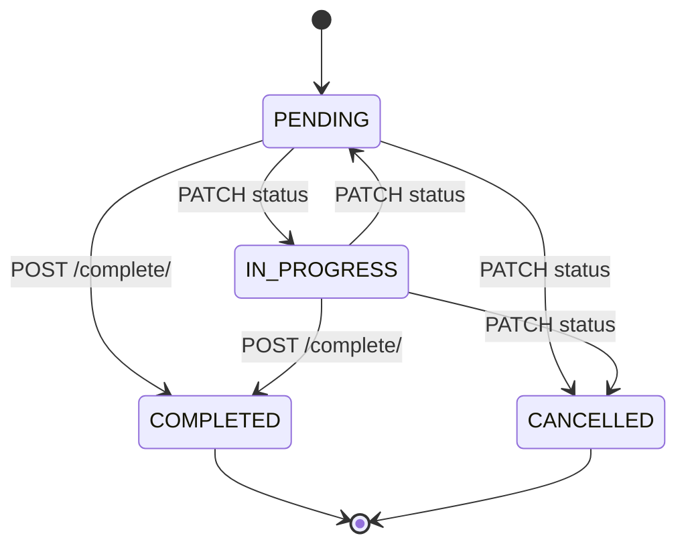
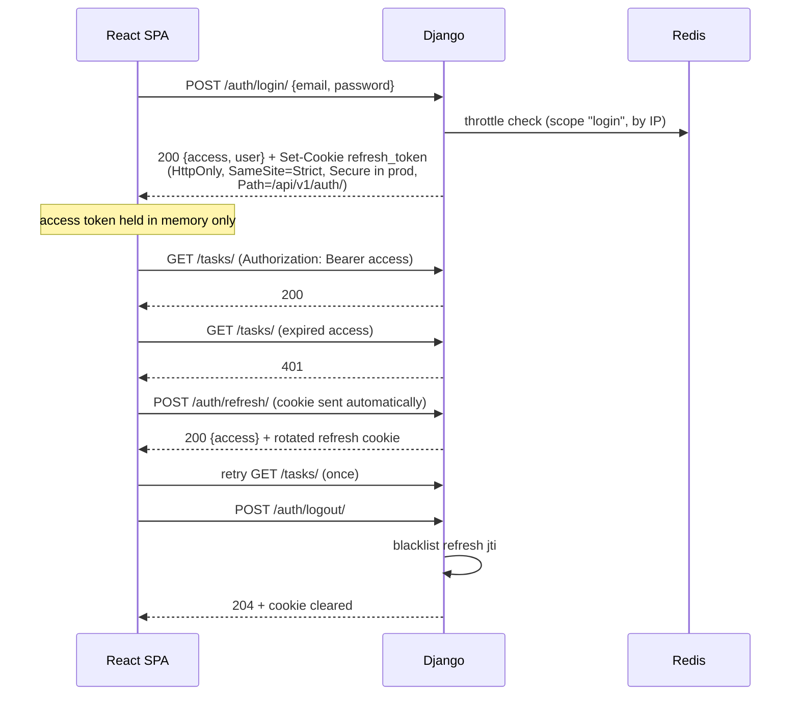
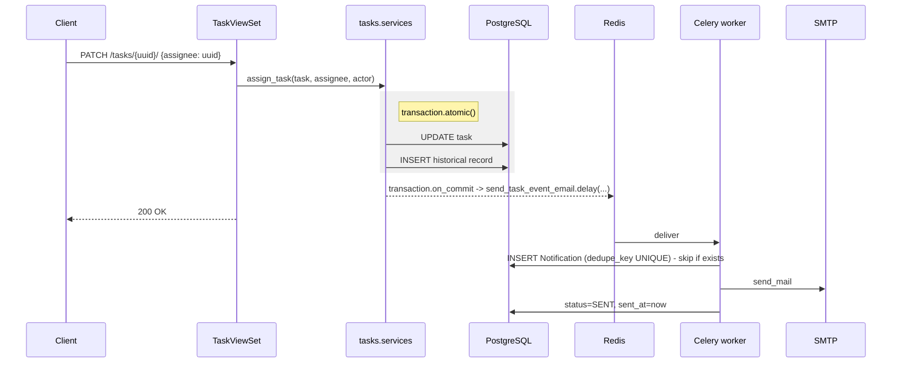

# Task Management System — Design Specification

**Date:** 2026-10-05
**Status:** Approved for implementation planning
**Repository:** `TaskManagementSystem`

---

## 1. Overview

A role-based task management system: a Django 6 / DRF JSON API plus a React single-page frontend. Three roles with strictly separated capabilities manage users and tasks; task changes trigger asynchronous email notifications, and a periodic sweep notifies on overdue tasks.

This document is the single source of truth for the design. It is written to be read cold, without the brainstorming conversation.

### 1.1 Goals

1. REST API for user and task CRUD with JWT authentication.
2. Three roles — Admin, Supervisor, Operator — with **strictly separated**, non-overlapping capabilities enforced server-side.
3. Task assignment, completion, and filtering by status and due date, with pagination.
4. Asynchronous email notifications on meaningful task changes, plus a scheduled overdue sweep.
5. Full audit history via `django-simple-history`.
6. At least 80% backend test coverage via pytest, concentrated on authentication, authorization, and task operations.
7. Reproducible local environment via Docker Compose, seeded with demo data.
8. A responsive React frontend covering login, both CRUD surfaces, and a task statistics dashboard.

### 1.2 Non-goals

Explicitly out of scope: multi-tenancy/organizations, task comments or attachments, real-time updates (websockets/SSE), task hierarchies or dependencies, in-app notification inbox, password reset by email, social/SSO login, production deployment infrastructure (Compose covers local development only), and internationalization.

### 1.3 User story

The "why" the rest of this document answers to:

> **As** a supervisor responsible for a team's workload, **I need** to create tasks, assign them to the right operator, and see at a glance what is overdue or unfinished, **so that** nothing silently slips past its due date.
>
> **As** an operator, **I need** to see only the work actually assigned to me and move it through to completion, **so that** my queue is unambiguous and I cannot be distracted by, or interfere with, anyone else's work.
>
> **As** an administrator, **I need** to manage who exists in the system and what they are allowed to do, **without** being able to read or alter the work itself, **so that** account administration and operational data stay separated.

The third clause is the one that shapes the architecture. It is why the permission matrix in §7 is strict rather than hierarchical, why an Admin is 403 on every `/tasks/*` route, and why that matrix is machine-readable data (D11) rather than scattered `if` statements — a separation this deliberate is worth being able to prove, not just assert.

Supporting narrative: a task assigned to an operator emails them; one that passes its due date while still open emails both operator and supervisor; and every change stays recoverable from the audit trail, because people who assign work need to be able to answer "who changed this, and when".

### 1.4 Project context

Three `AGENTS.md` files already govern this repository and take precedence over generic convention:

- `AGENTS.md` (root) — shared principles, frontend/backend trust boundary, JWT contract, Docker Compose environment, documentation requirements.
- `backend/AGENTS.md` — Django/DRF layering, model/constraint rules, permissions, throttling, testing strategy, tooling.
- `frontend/AGENTS.md` — React architecture, state-management split, API client, Tailwind styling, testing.

Section references of the form `backend §15` in this document point at those files. The places where this design **deliberately overrides** them are recorded in §3.4.

---

## 2. Scope assessment

This is one coherent application, not several independent subsystems, so a single spec and a single phased implementation plan are appropriate. The natural build order is: foundation and dependency verification → users and authentication → tasks and permissions → notifications → frontend → documentation and CI hardening. §15 gives the full sequence.

---

## 3. Decision log

Every non-obvious decision, with its rationale. This section is the basis for the "key implementation decisions" section of the root `README.md` (root §7).

### 3.1 Platform and dependencies

| # | Decision | Rationale |
|---|---|---|
| D1 | **Django `>=6.0,<6.1`** | The newest Django that *every* dependency actually tests against. DRF 3.18.1, django-simple-history 3.13.0 and django-filter 26.2 cover 6.0 and 6.1, but simplejwt@master and drf-spectacular 0.30.0 stop at 6.0. Pinning 6.0 leaves zero untested combinations while satisfying the "Django 6+" requirement. Trade-off: 6.0 left mainstream support when 6.1 shipped (Aug 2026), so it is a security-fix-only branch. |
| D2 | **Python `>=3.14`, Docker image `python:3.14-slim`** | Django 6.0 officially supports 3.12, 3.13 and 3.14. **3.14 is a hard floor, not a preference: `uuid.uuid7()` entered the standard library in 3.14** (D28), so anything lower would need a third-party UUIDv7 package. Directly verified for the two packages already carrying support risk: drf-spectacular 0.30.0 classifies 3.14, and the simplejwt commit pinned in D3 is the very commit that added Python 3.14 support. The remainder (DRF, django-simple-history, django-filter, Celery, psycopg, factory_boy) is **not** individually verified here — instead, `compat` stage 1 (§13) is the guard: `uv sync` fails outright if any dependency caps below 3.14, and it runs on day one before anything is built on the stack. Targeting the newest Python release is the least-evidenced link in an otherwise matrix-driven dependency story, which is why it gets a §16.1 row. |
| D3 | **simplejwt installed from git, pinned to commit `a7cb077ea0809f78cc6a99cb6825ab7594eae627`** | PyPI 5.5.1 (Jul 2025) predates PR #959 ("feat: add django 6.0 and python 3.14 support", merged 9 Feb 2026), which adds the Django 6.0 test matrix and replaces deprecated `pkg_resources` with `importlib.metadata`. Master therefore supports Django 6.0; the released package does not. |
| D4 | **drf-spectacular 0.30.0 instead of drf-yasg** | drf-yasg 1.21.17 still caps its classifiers at Django 5.2 and emits OpenAPI 2.0 only. drf-spectacular classifies Django 6.0, emits OpenAPI 3.0.3/3.1/3.2, and is actively maintained. Sanctioned by `backend §35`, which names either tool. Overrides the original brief's nomination of drf-yasg — and costs nothing to anyone expecting Swagger, since drf-spectacular serves a Swagger UI at `/api/v1/schema/swagger-ui/` alongside ReDoc. |
| D5 | **uv as package manager**, `pyproject.toml` + committed `uv.lock` | Required by the brief; `backend §44a` permits uv or Poetry, one consistently. |
| D6 | **No `django-safedelete`**; soft delete is roughly 40 owned lines | Avoids a third dependency carrying Django 6 lag risk, and its manager semantics would need our own tests regardless. |
| D7 | **No frontend charting library** | The dashboard presents six numbers: four status counts, an overdue total and a due-soon total (§11.5). Stat tiles and a CSS-grid distribution bar satisfy that without adding Recharts. Trivially swappable later. |

**Consequences of D3**, all recorded in `README.md`:

- The backend Docker image must install `git` so uv can resolve the git source.
- `uv.lock` captures the commit SHA, so builds remain reproducible.
- `pip-audit` and Dependabot **cannot** track a git pin, so this dependency sits outside automated advisory coverage.
- **Exit criterion:** revert to the PyPI package as soon as a simplejwt release containing #959 is published, then relax D1 toward Django 6.1.

```toml
[tool.uv.sources]
djangorestframework-simplejwt = { git = "https://github.com/jazzband/djangorestframework-simplejwt.git", rev = "a7cb077ea0809f78cc6a99cb6825ab7594eae627" }
```

### 3.2 Architecture

| # | Decision | Rationale |
|---|---|---|
| D8 | **Views + serializers + services + repositories + selectors** — the full layering of `backend §1` and `§2` | Adopted for consistency with the project's documented architecture and with the service layer, rather than omitting a layer per feature. The split is defined in §5.2: **repositories** own persistence of a single entity (fetch by identity, row locking, write, soft delete, dedupe insert); **selectors** own reusable or complex reads (role-scoped querysets, dashboard aggregation). Services depend on repositories, never on the ORM directly. |
| D9 | **Serializers never persist.** Every write goes view -> service -> repository; no view calls `serializer.save()`. | Keeps one write path per operation, which is what makes the §7.3 enforcement layers and the audit trail trustworthy. A serializer that also saves would be a second, untested way to mutate a `Task` — bypassing transition validation (D18/D19), notification enqueue (§10.2), and `select_for_update` (§12.3). Serializers keep validation and representation only. Made structurally enforceable rather than conventional — see the note below the table. |

| D10 | **Shared app named `apps/core/`** with explicitly-named modules | `backend §49` forbids `utils.py`/`common.py` dumping grounds. A shared app is unavoidable (soft-delete base model, pagination, exception handler, permission matrix); the rule is satisfied by giving every module inside it one named responsibility. |
| D11 | **Permission matrix as declarative data** in `apps/core/permissions/matrix.py` | Read by both the permission classes and a parametrized test suite, so the rules and their enforcement cannot drift. This is how "Admin cannot reach `/tasks/`" is actually proven. Scope is endpoint-level reachability only — see §12.2. |
| D12 | **No `django-guardian`** | The rules are role-derived, not per-object. Guardian would add a permissions table and a join for what is expressible as `Q(assignee=user)`. |

**On `backend §7`'s warning about trivial repositories.** `§7` cautions against repositories that only wrap `Model.objects.get(...)`. That caution is respected not by dropping the layer but by giving each repository real persistence behavior it owns outright — see §5.2 for the method inventory. `TaskRepository.get_for_update()` encapsulates row locking, `NotificationRepository.create_if_absent()` encapsulates unique-violation handling for the dedupe insert (§10.3b), and `UserRepository.get_by_email()` encapsulates email normalization (D24). None of those are passthroughs.

**On enforcing D9.** "No serializer persists" is not checkable if the write serializers are `ModelSerializer` subclasses, since `create()`/`update()` then exist by inheritance and `serializer.save()` would quietly work. So the rule is made structural rather than conventional: **write serializers (`UserCreate`, `UserUpdate`, `TaskCreate`, `TaskUpdate`) are plain `serializers.Serializer` subclasses** with explicit fields and no model binding, and read serializers are `ModelSerializer`. There is then nothing to bypass. The reviewable rule is "no view calls `serializer.save()`".

### 3.3 Domain

| # | Decision | Rationale |
|---|---|---|
| D13 | **Strict role separation.** Admin manages users only and has **no task access at all**. Supervisor manages all tasks and has **read-only, minimal-field** access to the user list. Operator manages only tasks **assigned to them**. | The brief's literal reading. Supervisor's user read is the one addition, needed to populate an assignee picker and to display who holds a task. |
| D14 | **Operator *visibility* is `assignee = me` only.** `created_by` grants no read access. | A Supervisor reassigning or unassigning a task revokes the original Operator's ability to see it immediately. `created_by` is **not** purely an audit field, though: it is load-bearing for the delete rule in D27 and for notification recipients in D26. It grants no visibility; it does gate one operation. |
| D15 | **Operator may read, update and complete any assigned task, but cannot change `assignee`** | "Tasks management for owned tasks", minus the ability to hand work off, which belongs to a Supervisor. Deletion is narrower still — see D27. |
| D16 | **On create, an Operator's task is always `assignee = self`** | Precisely: if an Operator **omits** `assignee`, it defaults to self; if an Operator **supplies a different user**, the request is rejected with 400 `assignee_immutable` (§8.7). Defaulting is a convenience; silently coercing a value the client explicitly sent would hide a client bug, so the explicit-mismatch case is an error, not a coercion. |
| D17 | **`assignee` must be a Supervisor or Operator, never an Admin** | Assigning to an Admin would create a task nobody can open, given D13. **Not expressible as a DB `CheckConstraint`** — it is a cross-table assertion — so it is enforced in the serializer *and* re-checked in the service, with tests at both levels. |
| D18 | **`POST /tasks/{id}/complete/` is the only path to `COMPLETED`.** `PATCH status=COMPLETED` returns 400. | One audited path for the state transition, per `backend §34`. Guarantees `completed_at` is always set alongside it. |
| D19 | **`COMPLETED` and `CANCELLED` are terminal** | Simpler invariant, and it matches the DB constraint tying `completed_at` to status. Reopening is a documented future extension, not a current requirement. |
| D20 | **Soft delete on every domain model — `User` and `Task`.** No restore endpoint; soft-deleted rows are invisible to the entire API. | Required for a meaningful audit trail alongside `django-simple-history`. **`Notification` is exempt**: it is an append-only log that no API exposes and no user deletes, so a `deleted_at` column on it would never be anything but null. Its FKs are therefore `CASCADE` rather than D25's `PROTECT` — if a row ever *is* hard-deleted in data repair, its notification log should go with it. |
| D21 | **A soft-deleted user's email becomes reusable** | Enforced by a partial unique index `WHERE deleted_at IS NULL` rather than a plain unique constraint. |
| D22 | **`is_active` and `deleted_at` are both retained, and are not synonyms** | `is_active` is Django's authentication gate; `deleted_at` is the soft-delete marker. Soft deletion sets both, but an Admin may deactivate a user *without* deleting them. |
| D23 | **`due_date` is `DateTimeField`, nullable** | Overdue detection compares to `timezone.now()` in an hourly sweep, which needs a time of day. Nullable because a task may legitimately have no deadline; `due_date__lt` excludes nulls automatically. Stored UTC with `USE_TZ=True`. |
| D24 | **Email stored lowercase-normalized in a plain `EmailField`** | Avoids requiring the Postgres `citext` extension and its migration, while still giving case-insensitive uniqueness. Normalization happens in the user manager and the serializer. |
| D25 | **`on_delete=PROTECT` on both task FKs** | Nothing is ever hard-deleted, so this should never fire; if it does, it must fail loudly rather than silently null an audit record. |
| D26 | **Notification recipients are gated by current read access** | A creator who is an Operator and no longer the assignee stops receiving that task's emails. Emailing someone about a task they cannot open is confusing and leaks information. Falls out of D14. |
| D27 | **An Operator may delete a task only if `created_by = self` as well as `assignee = self`.** Deleting an assigned task they did not create returns **403**. | Closes what was previously an accepted risk. Without it, an Operator could soft-delete Supervisor-assigned work — and since D20 provides no restore endpoint, that work would be irrecoverable through the API. An Operator can still decline work by other means (status, or asking a Supervisor); they cannot make someone else's task disappear. A Supervisor retains delete on every task. This is the **only** rule in the design where `created_by` affects authorization, which is why D14 is explicit that it is not merely an audit column. |
| D28 | **All primary keys are UUIDv7**, via `uuid.uuid7()` from the Python 3.14 standard library | Non-sequential ids remove resource enumeration from the API surface, and UUIDv7's 48-bit big-endian timestamp prefix keeps inserts append-ordered, so B-tree index locality stays close to a sequential integer's rather than fragmenting the way UUIDv4 would. CPython's implementation adds a 42-bit counter (RFC 9562 §6.2, "Monotonicity and Counters") that orders ids minted within the same millisecond **by the same process**; across processes, ordering is millisecond-granular. Costs no new dependency (D2). See §6.6 for the mechanics and the caveats. |

### 3.4 Deliberate overrides of `AGENTS.md`

| Override | AGENTS.md says | This design does | Why |
|---|---|---|---|
| **Celery beat service** | root § Local Development: *"Do not add further services beyond this (a beat/scheduler process, Flower, extra queues, Kafka)"* | Adds a `beat` service to `docker-compose.yml` | The brief requires scheduled overdue notifications, which needs a periodic scheduler. A separate `celery beat` process is the standard, production-shaped arrangement; Celery documents `worker -B` as development-only. Recorded in `README.md`. |
| **API docs tool** | `backend §35` names `drf-yasg` first | Uses `drf-spectacular` | D4. `§35` explicitly permits either. |
| **Dockerfile dependency install** | root § Local Development example uses `requirements.txt` + `pip` | Uses `uv sync` from `pyproject.toml`/`uv.lock`, and installs `git` | D5 (required by the brief) and D3. `backend §44a` already mandates `pyproject.toml` over `requirements*.txt`, so the root example is the outdated part. |

---

## 4. Technology stack

| Layer | Choice | Version |
|---|---|---|
| Language | Python | **`>=3.14`** (hard floor — stdlib `uuid.uuid7`), image `3.14-slim` |
| Framework | Django | `>=6.0,<6.1` |
| API | Django REST Framework | 3.18.1 |
| Auth | djangorestframework-simplejwt | git `a7cb077` (see D3) |
| API docs | drf-spectacular | 0.30.0 |
| Audit | django-simple-history | 3.13.0 |
| Filtering | django-filter | 26.2 |
| CORS | django-cors-headers | latest |
| Async | Celery + Redis | Celery 5.x, Redis 7 |
| Database | PostgreSQL | 16 |
| Package manager | uv | latest |
| Lint/format | ruff | pinned, identical in pre-commit and CI |
| Backend tests | pytest, pytest-django, pytest-cov, factory_boy | latest |
| Frontend | React + TypeScript + Vite | React 19, Vite 7 |
| Routing | TanStack Router | latest |
| Server state | TanStack Query | latest |
| Styling | Tailwind CSS | latest |
| Frontend tests | Vitest, React Testing Library, MSW | latest |

Versions listed as "latest" are resolved and locked by `uv.lock` / `package-lock.json` at implementation time.

---

## 5. Architecture

### 5.1 Containers



The frontend and backend communicate only over the HTTP API (root §3). Redis serves double duty as the Celery broker and the throttle cache — see §9.3 for why the latter matters.

### 5.2 Backend request flow

Per `backend §1`, with the full layering of D8:

```
Write:  HTTP Request -> ViewSet -> Serializer (validate) -> Service -> Repository -> ORM -> PostgreSQL
Read:   HTTP Request -> ViewSet -> Selector -> ORM -> PostgreSQL -> Serializer (represent)
```

Dependency direction is strictly downward. A service never touches the ORM directly; a repository never contains a business workflow; neither knows about `request`, HTTP status codes or DRF `Response` (`backend §8`).

**Repository vs selector** — the distinction that keeps both layers meaningful:

| | Repository | Selector |
|---|---|---|
| Returns | one entity, or nothing | a queryset |
| Answers | "fetch this exact row / write this row" | "which rows, under what rules" |
| Called by | services only | views (via `get_queryset`) and services |
| Owns | identity lookup, row locking, writes, soft delete, dedupe insert | role scoping, filtering, aggregation |

Reads still bypass the service layer and go view -> selector, because there is nothing to orchestrate. What changed from an earlier draft is that **writes no longer bypass anything**: there is exactly one path to mutating a row (D9).

**Method inventory**, so no repository is a `Model.objects.get()` passthrough (`backend §7`):

| Repository | Methods | Non-trivial behaviour it owns |
|---|---|---|
| `TaskRepository` | `get(id)`, `get_for_update(id)`, `add(task)`, `save(task)`, `soft_delete(task, by)` | `get_for_update` wraps `select_for_update()` — the concurrency guard `complete_task` depends on (§12.3). `soft_delete` sets `deleted_at` and `deleted_by` together. |
| `UserRepository` | `get(id)`, `get_by_email(email)`, `add(user)`, `save(user)`, `soft_delete(user, by)` | `get_by_email` applies D24's lowercase normalization, so no caller can accidentally do a case-sensitive lookup. `add` hashes the password. |
| `NotificationRepository` | `create_if_absent(dedupe_key, ...)`, `mark_sent(n)`, `mark_failed(n, error)` | `create_if_absent` encapsulates the `IntegrityError` catch on the unique `dedupe_key` and returns `None` when the row already exists — the whole idempotency mechanism of §10.3b lives here, in one tested place. |

Selectors: `tasks.selectors` holds `scoped_tasks(user)` (the D13/D14 role scoping), `overdue_candidates()` and `task_stats(user)`; `users.selectors` holds `scoped_users(user)` and `assignable_users()` (D17's Supervisor-or-Operator filter).

### 5.3 Backend layout

```
backend/
├── pyproject.toml
├── uv.lock
├── Dockerfile
├── manage.py
├── config/
│   ├── settings/
│   │   ├── base.py
│   │   ├── local.py
│   │   ├── test.py
│   │   └── production.py
│   ├── celery.py
│   ├── urls.py
│   ├── wsgi.py
│   └── asgi.py
└── apps/
    ├── core/
    │   ├── models.py               # UUIDPrimaryKeyModel, TimeStampedModel, SoftDeleteModel
    │   ├── managers.py             # SoftDeleteManager
    │   ├── roles.py                # Role TextChoices (see §6.2)
    │   ├── pagination.py           # DefaultPageNumberPagination
    │   ├── exceptions.py           # ApplicationError hierarchy + exception_handler
    │   ├── throttling.py           # scoped throttle classes
    │   ├── permissions/
    │   │   ├── matrix.py           # DECLARATIVE SOURCE OF TRUTH (D11)
    │   │   └── classes.py          # RolePermission, IsTaskCreator (D27)
    │   └── tests/
    ├── users/
    │   ├── models.py               # User (AbstractBaseUser), UserManager
    │   ├── serializers.py          # UserSerializer, UserCreate/Update, UserMinimal
    │   ├── views.py                # UserViewSet, MeView, auth views
    │   ├── services.py             # create_user, update_user, soft_delete_user
    │   ├── repositories.py         # UserRepository
    │   ├── selectors.py            # scoped_users, assignable_users
    │   ├── filters.py              # UserFilterSet
    │   ├── admin.py
    │   ├── urls.py
    │   ├── management/commands/seed_demo_data.py
    │   ├── migrations/
    │   └── tests/
    ├── tasks/
    │   ├── models.py               # Task, TaskStatus, TRANSITIONS
    │   ├── serializers.py
    │   ├── views.py                # TaskViewSet (+ complete, stats actions)
    │   ├── filters.py              # TaskFilterSet
    │   ├── services.py             # create/update/assign/complete/change_status/soft_delete
    │   ├── repositories.py         # TaskRepository
    │   ├── selectors.py            # scoped_tasks, overdue_candidates, task_stats
    │   ├── exceptions.py
    │   ├── urls.py
    │   ├── migrations/
    │   └── tests/
    └── notifications/
        ├── models.py               # Notification, NotificationEvent
        ├── tasks.py                # Celery tasks
        ├── services.py             # recipient resolution, dedupe key construction
        ├── repositories.py         # NotificationRepository (create_if_absent)
        ├── emails.py               # subject/body rendering
        ├── templates/
        ├── migrations/
        └── tests/
```

### 5.4 Auth bootstrap ordering

`AUTH_USER_MODEL` points at `users.User` from the very first migration. The custom user model must exist before any migration references it, so `apps.users` is created before `apps.tasks` in the build order (§15).

---

## 6. Data model

### 6.1 Entity relationship diagram



**`history_id` stays a `BigAutoField`.** `SIMPLE_HISTORY_HISTORY_ID_USE_UUID` is left at its default of `False`, deliberately: the history id is never exposed through the API, so non-enumerability buys it nothing, while §10.3b composes it into `Notification.dedupe_key` where an integer keeps the key shorter. (A UUID there would still fit inside `max_length=160`; the reason is the absence of benefit, not a length limit.)

`User` and `Task` each declare `history = HistoricalRecords()`. Because deletion is soft, `simple-history` records it as an ordinary update (`history_type='~'`), so the audit trail remains continuous and the deleted row's final state is preserved.

`Notification` is **neither historised nor soft-deletable** — it is already an append-only record, no API exposes it, and nothing deletes it (D20). This is why its two FKs are `CASCADE` while `Task`'s are `PROTECT`.

### 6.2 `User`

Custom model on `UUIDPrimaryKeyModel` + `SoftDeleteModel` + `AbstractBaseUser` + `PermissionsMixin`, with `USERNAME_FIELD = "email"` and `REQUIRED_FIELDS = ["first_name", "last_name"]`. Primary key is UUIDv7 per D28 (§6.6).

```python
# apps/core/roles.py
class Role(models.TextChoices):
    ADMIN      = "ADMIN",      "Admin"
    SUPERVISOR = "SUPERVISOR", "Supervisor"
    OPERATOR   = "OPERATOR",   "Operator"
```

Role is a `CharField(choices=Role.choices)` on the user, **not** Django `Group` membership: it is single-valued, indexed, cheap to filter on, and directly readable by the permission matrix without a join.

**`Role` lives in `apps/core/roles.py`, not in `apps/users/models.py`.** Both the user model and the permission matrix need it, and the matrix lives in `core`. Defining it in `users` would force `core` to import a feature app — inverting the dependency direction D10 exists to protect, and creating a circular import with `core.permissions.classes`. `apps.users.models` imports it from `core`, keeping the direction feature -> shared. This also decides the build order: `core` can be completed before `users` exists (§15).

**Constraints and indexes**

| Kind | Definition | Purpose |
|---|---|---|
| Unique | `UniqueConstraint("email", condition=Q(deleted_at__isnull=True), name="uniq_active_user_email")` | uniqueness among live users; makes a deleted user's email reusable (D21) |
| Index | `("role",)` partial `WHERE deleted_at IS NULL` | assignee validation, Admin user list, Supervisor assignee picker |
| Index | `("deleted_at",)` | soft-delete filtering |

Password validation uses Django's `AUTH_PASSWORD_VALIDATORS`. Passwords are write-only on input and never appear in any serializer output.

### 6.3 `Task`

```python
class TaskStatus(models.TextChoices):
    PENDING     = "PENDING",     "Pending"
    IN_PROGRESS = "IN_PROGRESS", "In progress"
    COMPLETED   = "COMPLETED",   "Completed"
    CANCELLED   = "CANCELLED",   "Cancelled"
```

Fields (`Task` inherits `UUIDPrimaryKeyModel`, `TimeStampedModel` and `SoftDeleteModel`):

- `id` — UUIDv7 primary key (§6.6).
- `title` — `CharField(max_length=200)`, required, non-blank.
- `description` — `TextField(blank=True, default="")`.
- `status` — `CharField(choices=TaskStatus.choices, default=PENDING)`.
- `due_date` — `DateTimeField(null=True, blank=True)` (D23).
- `assignee` — `FK(User, null=True, blank=True, on_delete=PROTECT, related_name="assigned_tasks")`.
- `created_by` — `FK(User, on_delete=PROTECT, related_name="created_tasks")`, not null.
- `completed_at` — `DateTimeField(null=True, blank=True)`.
- `is_overdue` — a **model property**, not a field: `due_date is not None and status in (PENDING, IN_PROGRESS) and due_date < now()`. It is computed from already-loaded data, so serializing it adds no query. Filtering uses an equivalent database `Q()` (§8.4).

**Constraint**

| Kind | Definition | Purpose |
|---|---|---|
| Check | `completed_at IS NOT NULL` if and only if `status = 'COMPLETED'` | database-level guarantee that D18's invariant cannot be bypassed by any code path, including the Django admin and data migrations |

```python
CheckConstraint(
    condition=Q(status="COMPLETED", completed_at__isnull=False)
            | (~Q(status="COMPLETED") & Q(completed_at__isnull=True)),
    name="task_completed_at_matches_status",
)
```

The "assignee is not an Admin" rule (D17) is **deliberately absent** from this table: it is a cross-table assertion and not expressible as a `CheckConstraint`. It is enforced at the serializer and service layers, with tests at both.

**Indexes** — every index is **partial**, scoped `WHERE deleted_at IS NULL`, so it covers only live rows:

| Index | Serves |
|---|---|
| `("status", "due_date")` | the primary list filter (status and/or due-date range) **and** the hourly overdue sweep |
| `("assignee", "status")` | an Operator's scoped list, and Supervisor filtering by assignee |
| `("due_date",)` | due-date-only range queries and ordering |
| `("deleted_at",)` | soft-delete filtering |

There is still **no index on `created_by`**, even though D27 makes it load-bearing for authorization. The reason is that D27's check is `task.created_by_id == user.id` on a row the request has *already* fetched through the `(assignee, status)` index — a single in-memory attribute comparison, not a query. No `WHERE created_by = ...` is ever issued: nothing filters, scopes or joins on it, so `backend §30`'s evidence-driven rule still says no index. If a "created by" **filter** is added later, the index comes with it.

`Meta.ordering` is **not** set; ordering is applied explicitly per queryset so pagination determinism is a conscious choice (§8.3).

### 6.4 Status transitions



`COMPLETED` and `CANCELLED` are terminal (D19). `COMPLETED` is reachable **only** via `POST /tasks/{id}/complete/` (D18); a `PATCH` carrying `status=COMPLETED` returns 400 with code `use_complete_action`. Any other disallowed transition returns **409 Conflict** with code `invalid_status_transition`.

The transition map lives as a module-level dict in `apps/tasks/models.py` and is consumed by both the service and its tests.

### 6.5 Soft delete (D20)

`apps/core/models.SoftDeleteModel` is an abstract base inheriting `UUIDPrimaryKeyModel` (§6.6), providing:

- `deleted_at` — `DateTimeField(null=True, db_index=True)`
- `deleted_by` — `FK(settings.AUTH_USER_MODEL, null=True, on_delete=SET_NULL, related_name="+")`
- `objects = SoftDeleteManager()` — the **default manager**, filtering `deleted_at__isnull=True`
- `all_objects = models.Manager()` — escape hatch for tests, data repair, and audit queries
- `soft_delete(by)` — sets both fields and saves

`delete()` is **deliberately not overridden.** Overriding it would make `queryset.delete()` and cascade behaviour surprising, and would hide genuine hard deletes during data migrations. Services call `soft_delete()` explicitly; `delete()` retains Django's real meaning.

`Meta.base_manager_name` is **not** set to the soft-delete manager, so related-object descriptors continue to use a plain manager and `PROTECT` behaves predictably.

Because the default manager filters deleted rows, no viewset needs its own `deleted_at` filter — which removes the single most likely place for a data leak (`backend §5`).

### 6.6 UUIDv7 primary keys (D28)

```python
# apps/core/models.py
import uuid
from django.db import models

class UUIDPrimaryKeyModel(models.Model):
    id = models.UUIDField(primary_key=True, default=uuid.uuid7, editable=False)

    class Meta:
        abstract = True
```

`uuid.uuid7` is passed as a **reference, not a call**, and is a stdlib function, so Django serializes it into migrations the same way `uuid.uuid4` has always been serialized. No helper module and no third-party package are needed (D2).

Every model inherits it: `SoftDeleteModel` extends it (so `User` and `Task` get it), and `Notification` inherits it directly. `Notification` gains nothing security-wise — it is never API-exposed — but a schema with two different primary-key types is a maintenance trap, and exposing it later would then require a key migration.

**Why v7 and not v4.** On PostgreSQL both store as the native 16-byte `uuid` type, so the difference is purely index behaviour. A UUIDv4 primary key writes to a uniformly random point in the B-tree on every insert, which spreads writes across the whole index, inflates it through page splits, and destroys cache locality. UUIDv7 puts a 48-bit big-endian millisecond timestamp in the high bits, and Postgres compares `uuid` values bytewise, so inserts land at the right-hand edge of the index exactly as a sequential integer's do.

**Monotonicity is per-process, not global.** CPython's `uuid7` holds its 42-bit counter in module-level state, so ids minted inside one millisecond are strictly ordered only within a single process. This design runs several processes that insert rows — gunicorn workers, the Celery worker (which inserts every `Notification`), beat — so across the system the ordering is millisecond-granular. Nothing here depends on a cross-process total order: §8.3 needs uniqueness and stability, both of which hold unconditionally, and §12.3's ordering assertion runs in one process.

**Three caveats**, all recorded in §16.1:

1. **A UUIDv7 is not a secret.** It defeats *enumeration* — nobody can walk `/tasks/1`, `/tasks/2` — which is the real weakness of integer keys on an API. It is not a token, though. Of its 122 payload bits, 48 are a timestamp; CPython reseeds the counter randomly each time the millisecond advances and draws a fresh 32-bit tail per call, so a cold guess against a known millisecond faces roughly 2^73 — infeasible. But a **sibling** id minted in the same millisecond by the same process is far weaker, since the counter advances by increment. So: **ids must never be treated as capability tokens.** Authorization carries all the weight — §7.3's queryset scoping and 404-for-non-participants protect a row exactly as they would with integer keys.
2. **A UUIDv7 discloses its creation time** to anyone who can read the id. For `Task` this is free, since `created_at` is in every representation (§8.2). For `User` it is **not**: `UserMinimalSerializer` exposes `id` but deliberately omits `date_joined`, which §7.2 rule 2 keeps Admin-only and §16.2 names a privilege boundary. So a Supervisor — or anyone who can see a nested `assignee` or `created_by` — can recover any user's account-creation time from the id. This is a real, if minor, widening of that boundary, and it is accepted rather than designed around; §16.1 records the mitigation.
3. **Keys are 16 bytes rather than 8**, so indexes are roughly twice the key size and every foreign key widens correspondingly. At this scale the trade is comfortably worth non-enumerable ids.

**Knock-on effects elsewhere in the design:**

| Area | Effect |
|---|---|
| §8.1 URLs | path parameters are UUID strings. Viewsets set `lookup_value_regex` to the **canonical hyphenated 8-4-4-4-12 hex form** so a malformed id yields a clean 404 instead of reaching the database. It must **not** be a UUID*v4* pattern — pinning the version nibble to `4` and the variant to `[89ab]` would reject every v7 id and 404 every detail route, and §12.3's malformed-id test would still pass, so nothing would catch it |
| §8.3 pagination | `-id` remains a valid unique tiebreaker *and* becomes time-correlated, since v7 sorts by creation. With v4 it would still be unique — so pagination would still be stable — but the ordering would carry no meaning |
| §10.3b | `dedupe_key` is now `{uuid}:{EVENT}:{uuid}:{history_id}`, around 100 characters; the field is `max_length=160` with its unique index |
| §11 frontend | every `id` in `types.ts` is `string`, never `number` |
| drf-spectacular | ids are documented as `string($uuid)` in the OpenAPI 3 schema automatically |

---

## 7. Roles and permissions

### 7.1 Capability matrix

The authoritative, machine-readable version lives in `apps/core/permissions/matrix.py` (D11). This table mirrors it.

| Endpoint | Admin | Supervisor | Operator | Unauthenticated |
|---|---|---|---|---|
| `POST /auth/login/` | allowed | allowed | allowed | allowed |
| `POST /auth/refresh/` | allowed | allowed | allowed | allowed (cookie) |
| `POST /auth/logout/` | allowed | allowed | allowed | 401 |
| `GET /users/me/` | allowed (minimal) | allowed (minimal) | allowed (minimal) | 401 |
| `GET /users/` | allowed (full) | **allowed (read-only, minimal)** | **403** | 401 |
| `POST /users/` | allowed | **403** | **403** | 401 |
| `GET /users/{id}/` | allowed (full) | allowed (minimal) | **403** | 401 |
| `PATCH /users/{id}/` | allowed | **403** | **403** | 401 |
| `DELETE /users/{id}/` | allowed (soft) | **403** | **403** | 401 |
| `GET /tasks/` | **403** | allowed (all) | allowed (`assignee = me`) | 401 |
| `POST /tasks/` | **403** | allowed (any valid assignee) | allowed (**self-assigned only**) | 401 |
| `GET /tasks/{id}/` | **403** | allowed | own, else **404** | 401 |
| `PATCH /tasks/{id}/` | **403** | allowed (incl. `assignee`) | own, **`assignee` immutable** | 401 |
| `DELETE /tasks/{id}/` | **403** | allowed (soft) | **only if `created_by = me` too** (soft), else **403** | 401 |
| `POST /tasks/{id}/complete/` | **403** | allowed | own | 401 |
| `GET /tasks/stats/` | **403** | allowed (global) | allowed (own) | 401 |

### 7.2 Rules this encodes

1. **Admin has no task surface whatsoever** — every `/tasks/*` route returns 403 for an Admin, including `stats/`. Admin therefore has no dashboard; the Admin landing page is user management.
2. **Supervisor's user access is a different serializer, not a flag.** `UserMinimalSerializer` exposes `id`, `first_name`, `last_name`, `email`, `role` — enough for an assignee picker and to display a task's holder. `is_active`, `is_staff`, `is_superuser`, `date_joined`, `last_login` and history remain Admin-only. Write methods are rejected at the permission layer, before serialization.
3. **`GET /users/me/` is open to every authenticated role** because it is identity, not user management — the SPA needs its own role to route and to render the correct navigation. It returns the minimal shape.
4. **Operator *visibility* is `assignee = me`** (D14). `created_by` grants no visibility whatsoever — it does not widen a list, and it does not turn a 404 into a 200. It is not, however, irrelevant to authorization: see rule 7.
5. **A non-participant detail request returns 404, not 403** (`backend §38`) — 403 would confirm the row exists. This is implemented by queryset scoping, so list and detail cannot disagree.
6. **403 vs 404 is role-dependent and deliberate.** An Admin hitting `/tasks/{id}/` gets **403**, because the role has no business with that resource type at all. An Operator hitting another Operator's task gets **404**, because the resource type is theirs but that instance is not.
7. **An Operator's delete is narrower than their read (D27).** Deletion requires `created_by = me` *in addition to* `assignee = me`, so an Operator cannot soft-delete work a Supervisor assigned to them — which, given D20 has no restore endpoint, would otherwise be irrecoverable through the API. This is the single place in the design where `created_by` affects authorization.

   The response is **403, not 404**, and that is consistent with rule 5 rather than an exception to it: rule 5 withholds existence, and here the task *is* in the Operator's queryset, so nothing is withheld — they can already see it. Hiding it at this point would be incoherent; the refusal is "you may not do this to it", not "it does not exist for you". It is also an object-level permission check (`IsTaskCreator.has_object_permission`), which keeps 403 exclusive to the two permission layers per §7.3.

### 7.3 Enforcement layers

Three independent mechanisms, per `backend §15`:

| Layer | Responsibility | Output |
|---|---|---|
| **Permission class** (`RolePermission`) | reads the matrix and answers "may this role call this endpoint at all?" | 403 |
| **Object permission** (`IsTaskCreator`, D27) | "may this role do *this* to *this row*?" — currently only the Operator delete rule | 403 |
| **Queryset scoping** (`get_queryset` -> selector) | restricts which rows exist from this user's perspective: correct list contents, and 404 on out-of-scope detail | 404 |
| **Serializer / service validation** | field-level rules: Operator cannot choose an assignee, assignee cannot be an Admin, status transitions | 400 / 409 |

403 is produced only by the two permission layers, 404 only by scoping, and 400/409 only by validation — so the response code alone tells you which layer refused the request.

Queryset scoping is what makes list visibility correct; an object-level permission check alone would not filter a list (`backend §15`). Conversely, scoping alone cannot express D27, because the row must stay *visible* while becoming *undeletable* — which is precisely the case object-level permissions exist for.

---

## 8. API surface

Base path `/api/v1/`. Trailing slashes. Plural resource nouns. State transitions as named sub-resources (`backend §34`).

Every `{id}` below is a **UUIDv7** string, not an integer (D28). Viewsets constrain `lookup_value_regex` to the canonical UUID form, so a malformed id returns 404 without reaching the database.

### 8.1 Endpoints

```
POST   /api/v1/auth/login/
POST   /api/v1/auth/refresh/
POST   /api/v1/auth/logout/

GET    /api/v1/users/me/

GET    /api/v1/users/                 ?page=&page_size=&role=&is_active=&search=
POST   /api/v1/users/
GET    /api/v1/users/{id}/
PATCH  /api/v1/users/{id}/
DELETE /api/v1/users/{id}/            -> 204, soft delete

GET    /api/v1/tasks/                 ?page=&page_size=&status=&due_date_after=
                                      &due_date_before=&overdue=&assignee=&ordering=
POST   /api/v1/tasks/
GET    /api/v1/tasks/{id}/
PATCH  /api/v1/tasks/{id}/
DELETE /api/v1/tasks/{id}/            -> 204, soft delete
POST   /api/v1/tasks/{id}/complete/   -> 200
GET    /api/v1/tasks/stats/

GET    /api/v1/schema/
GET    /api/v1/schema/swagger-ui/
GET    /api/v1/schema/redoc/
```

### 8.2 Serializers

Input and output contracts are separate (`backend §13`); no serializer uses `fields = "__all__"`.

| Serializer | Fields |
|---|---|
| `UserSerializer` (Admin read) | `id, email, first_name, last_name, role, is_active, is_staff, date_joined, last_login` |
| `UserCreateSerializer` | `email, password` (write-only)`, first_name, last_name, role` |
| `UserUpdateSerializer` | `first_name, last_name, role, is_active, password` (write-only, optional) |
| `UserMinimalSerializer` | `id, email, first_name, last_name, role` |
| `TaskListSerializer` | `id, title, status, due_date, assignee` (nested minimal)`, is_overdue, created_at` |
| `TaskDetailSerializer` | list fields plus `description, created_by` (nested minimal)`, completed_at, updated_at` |
| `TaskCreateSerializer` | `title, description, due_date, assignee` |
| `TaskUpdateSerializer` | `title, description, due_date, assignee, status` |

`TaskCreateSerializer` and `TaskUpdateSerializer` receive the request user through serializer context and apply D15/D16/D17 in `validate()`. **None of these serializers implements `create()` or `update()`** (D9): the view calls `serializer.is_valid(raise_exception=True)`, hands `validated_data` plus the actor to a service, and renders the result with the matching read serializer.

### 8.3 Pagination

`DefaultPageNumberPagination` in `apps/core/pagination.py`, registered as `DEFAULT_PAGINATION_CLASS`: `page_size = 20`, `page_size_query_param = "page_size"`, `max_page_size = 100`.

Response envelope:

```json
{ "count": 137, "next": "...?page=3", "previous": "...?page=1", "results": [] }
```

**Deterministic ordering is required** (`backend §17`). Every paginated queryset ends with a unique tiebreaker: the default task ordering is `("-created_at", "-id")`, and user ordering is `("email",)` (unique among live rows). Ordering by `due_date` or `status` alone would be unstable, so `OrderingFilter` always appends `-id`.

### 8.4 Filtering

A `django-filter` `TaskFilterSet` (`backend §16`) — no manual query-parameter parsing, and no model field becomes filterable implicitly:

| Param | Type | Behaviour |
|---|---|---|
| `status` | multiple choice | `?status=PENDING&status=IN_PROGRESS` -> `status__in` |
| `due_date_after` | ISO datetime | `due_date__gte` |
| `due_date_before` | ISO datetime | `due_date__lte` |
| `overdue` | boolean | `true` -> `Q(due_date__lt=now, status__in=(PENDING, IN_PROGRESS))`. `false` -> `~Q(...)` **plus an explicit null branch** (see below) |
| `assignee` | user id | available to Supervisors; ignored for Operators, whose queryset is already self-scoped |
| `ordering` | enum | `due_date`, `-due_date`, `created_at`, `-created_at`, `status`; always tiebroken with `-id` |

The `overdue` filter is a small deliberate addition beyond the brief: the dashboard surfaces an overdue count, and that count must be clickable through to the matching list.

**`overdue=false` must handle NULL `due_date` explicitly.** In SQL, `NOT (due_date < now)` is `NULL` — not `TRUE` — for a row with no due date, so a bare negation silently drops every undated task from the result. Both of the following count as **not overdue** and must appear when `overdue=false`:

- a task with `due_date IS NULL` (no deadline, so it cannot be late)
- a task in a terminal status (`COMPLETED`/`CANCELLED`), whatever its due date

So the false branch is `Q(due_date__isnull=True) | Q(due_date__gte=now) | Q(status__in=(COMPLETED, CANCELLED))`, and `overdue=true` plus `overdue=false` must partition the queryset exactly. The same reasoning applies to the `due_next_7_days` figure in §8.5, which also excludes nulls and terminal statuses.

`UserFilterSet` exposes `role` and `is_active`, plus a `search` over `email`/`first_name`/`last_name` via DRF's `SearchFilter`.

### 8.5 Statistics endpoint

`GET /api/v1/tasks/stats/`, scoped identically to `GET /tasks/` (Supervisor global, Operator own, Admin 403):

```json
{
  "total": 42,
  "by_status": { "PENDING": 10, "IN_PROGRESS": 12, "COMPLETED": 18, "CANCELLED": 2 },
  "overdue": 5,
  "due_next_7_days": 7
}
```

Computed in a **single** `.aggregate()` using conditional `Count(Case(When(...)))` expressions — one database round trip, no Python-side looping. This is the clearest demonstration of the query-optimisation requirement, and it is asserted with `django_assert_num_queries(1)`.

### 8.6 Query optimisation

| Endpoint | Technique |
|---|---|
| `GET /tasks/` | `select_related("assignee")` **only** — `TaskListSerializer` (§8.2) does not render `created_by`, so joining it would fetch a column nobody reads. No `prefetch_related` is needed: the task representation has no to-many relation. |
| `GET /tasks/{id}/` | `select_related("assignee", "created_by")` — `TaskDetailSerializer` renders both |

**Which layer applies the joins.** `scoped_tasks(user)` owns the role scoping and nothing else; the viewset chains `.select_related(...)` onto it per action, because eager loading follows the *serializer* in use (§8.2) rather than the authorization rules. This keeps the selector reusable by the sweep and by `task_stats`, neither of which wants a join at all.
| `GET /tasks/stats/` | one conditional `.aggregate()` |
| `GET /users/` | no related fields in the representation; nothing to join |
| overdue sweep | `.values_list("id", "assignee_id", "created_by_id").iterator()` — never materialises `Task` instances |

`only()`/`defer()` are **not** used: `backend §5` requires a demonstrated reason, and there is none here.

Every list and detail endpoint carries a `django_assert_num_queries` test, so an N+1 introduced later fails CI instead of being discovered in production.

### 8.7 Error contract

A single `exception_handler` in `apps/core/exceptions.py` (`backend §18`) produces one shape for every error:

```json
{ "detail": "Human-readable message.", "code": "invalid_status_transition", "errors": null }
```

For validation failures, `errors` carries the per-field map and `code` is `validation_error`:

```json
{
  "detail": "Invalid input.",
  "code": "validation_error",
  "errors": { "assignee": ["An Admin cannot be assigned tasks."] }
}
```

Application errors subclass `ApplicationError` with a `code` and a `status_code`:

| Exception | Code | Status |
|---|---|---|
| `InvalidStatusTransition` | `invalid_status_transition` | 409 |
| `CompletionRequiresCompleteAction` | `use_complete_action` | 400 |
| `AssigneeNotAssignable` | `assignee_not_assignable` | 400 |
| `AssigneeImmutableForRole` | `assignee_immutable` | **400** |

**The two assignee errors are distinct rules and must not share a code.** They fail for different reasons and the frontend needs to tell them apart from `code` alone, without parsing `detail`:

| Code | Means | Raised when |
|---|---|---|
| `assignee_not_assignable` | *that user* cannot hold tasks | any role assigns to an **Admin** (D17) |
| `assignee_immutable` | *your role* cannot choose an assignee at all | an **Operator** supplies a different assignee on create (D16) or any assignee on update (D15) |

The object-permission layer adds one more, raised as a DRF `PermissionDenied` rather than an `ApplicationError`:

| Code | Status | Raised when |
|---|---|---|
| `delete_requires_creator` | **403** | an **Operator** deletes an assigned task they did not create (D27) |

`AssigneeImmutableForRole` is deliberately **400, not 403.** Two reasons: the Operator create-side case is already a 400, so the same rule on update must not return a different **status**; and §7.3 reserves 403 for the two permission layers, which keeps all four enforcement layers distinguishable from the response code alone. The request is refused because one field in the payload is not writable by this role — a field-level validation failure, which is what 400 means here.

`delete_requires_creator` must be **raised, not returned.** Returning `False` from `has_object_permission` produces DRF's generic `permission_denied` code; emitting this one requires `IsTaskCreator` to raise `PermissionDenied(detail=..., code="delete_requires_creator")` itself.

Stack traces, database errors, secrets and infrastructure details are never returned (`backend §18`). Unexpected exceptions are logged with context and returned as a bare 500.

---

## 9. Authentication and security

### 9.1 Token flow



Per root § Authentication & Trust Boundary: the **access token lives only in frontend memory**, never `localStorage`/`sessionStorage`; the **refresh token is only ever an HttpOnly cookie** and never appears in a JSON body.

This requires thin subclasses of simplejwt's `TokenObtainPairView` and `TokenRefreshView` that move the refresh token out of the response body into the cookie, and read it back from the cookie rather than the body. `rest_framework_simplejwt.token_blacklist` is installed so logout genuinely revokes, with `ROTATE_REFRESH_TOKENS=True` and `BLACKLIST_AFTER_ROTATION=True`.

Lifetimes: access **15 minutes**, refresh **7 days**.

### 9.2 Cookie, CSRF and CORS

- Cookie attributes: `HttpOnly`, `SameSite=Strict`, `Secure` in production, and **`Path=/api/v1/auth/`** so the refresh token is not attached to ordinary API requests — it is only sent where it is needed.
- `SameSite=Strict` is the primary CSRF defence for the cookie-authenticated endpoints: a cross-site request will not carry the cookie at all. Django's CSRF middleware remains **enabled** and is **never** globally disabled (`backend §21`); `CSRF_TRUSTED_ORIGINS` lists the frontend origin.
- Every other endpoint authenticates via `Authorization: Bearer`, which is immune to CSRF because the browser never attaches it automatically.
- CORS is explicit (`backend §22`): `CORS_ALLOWED_ORIGINS` enumerates origins (`http://localhost:5173` locally) and `CORS_ALLOW_CREDENTIALS=True` so the refresh cookie flows. `CORS_ALLOW_ALL_ORIGINS` is never set.
- **`SameSite=Strict` and cross-origin credentials coexist here only because the two origins are same-site.** Locally, `localhost:5173` and `localhost:8000` differ by port, which CORS treats as cross-origin but `SameSite` does not — ports are not part of a site. A deployment that puts the SPA and the API on different registrable domains would silently stop sending the refresh cookie, and refresh would fail with no CORS error to explain it. Such a deployment must either serve both from one registrable domain (the recommendation) or move to `SameSite=Lax`/`None` and add explicit CSRF token validation on the refresh and logout endpoints.
- Production settings assert `DEBUG=False`, `ALLOWED_HOSTS` from env, `SECURE_HSTS_SECONDS`, `SECURE_SSL_REDIRECT`, `SESSION_COOKIE_SECURE`, `CSRF_COOKIE_SECURE` (`backend §23`).

### 9.3 Rate limiting

DRF throttling (`backend §22a`), with rates centralised in `DEFAULT_THROTTLE_RATES`:

| Scope | Rate | Applies to |
|---|---|---|
| `login` | **5/min**, keyed by IP | `POST /auth/login/` — brute-force defence on the most-attacked endpoint |
| `refresh` | 30/min | `POST /auth/refresh/` |
| `anon` | 20/min | any other unauthenticated request |
| `user` | 120/min | authenticated traffic |

**The throttle cache is Redis, not `LocMemCache`.** This is not incidental: `LocMemCache` is per-process, so each gunicorn worker would keep a private counter and the effective limit would become `rate x worker_count` — a limit that silently does not hold. Redis is already in the stack for Celery, so this adds no service. A dedicated cache alias (`throttle`) keeps the counters separate from any future application cache.

Exceeding a limit returns **429** with the standard `Retry-After` header. Failed login attempts are logged with IP and email (`backend §20`) — never with the password.

### 9.4 Secrets and logging

Configuration comes from environment variables only; `SECRET_KEY`, database credentials and the SMTP password are never hardcoded (`backend §24`). `.env.example` is committed; `.env` is not.

Structured logging includes request id, user id, endpoint, method, status and duration. Passwords, JWTs, refresh tokens and full `Authorization` headers are never logged (`backend §28`).

---

## 10. Background processing

### 10.1 Notification events

| Event | Trigger | Recipients |
|---|---|---|
| `ASSIGNED` | `assignee` changes to a non-null user | the **new** assignee |
| `STATUS_CHANGED` | `status` changes, including completion | assignee **and** `created_by` |
| `DUE_DATE_CHANGED` | `due_date` changes | the assignee |
| `OVERDUE` | hourly sweep finds a live, non-terminal, past-due task | assignee **and** `created_by` |

Title and description edits are intentionally silent — they are not operationally meaningful, and notifying on them would make every update test assert on an outbound email.

**Two filters apply to every recipient list:**

1. **Read-access gate (D26):** a recipient must currently be able to read the task under §7.1. In practice a `created_by` user who is an Operator but no longer the assignee is dropped, while a `created_by` Supervisor is retained, because Supervisors see all tasks.
2. **Actor suppression:** if `actor == recipient`, the recipient is dropped. Nobody is emailed about their own action.

Recipient resolution lives in `apps/notifications/services.py` and is unit-tested independently of Celery and of email.

### 10.2 Dispatch flow



### 10.3 Three failure modes, handled explicitly

**(a) Enqueueing inside a transaction.** Calling `.delay()` inside `transaction.atomic()` can deliver the message to a worker *before* the transaction commits, so the worker reads a row that does not yet exist — or reads a pre-update version. **Every** enqueue therefore goes through `transaction.on_commit(...)`. Services perform the enqueue; views never do (`backend §32`).

**(b) Retries double-send.** `Notification.dedupe_key` is `UNIQUE` (`max_length=160`, sized for two UUIDv7s plus the event name and history id — §6.6), and the worker inserts the row **before** sending, through `NotificationRepository.create_if_absent()`. That method owns the `IntegrityError` catch and returns `None` when the key already exists, so a retry of an already-sent event exits without sending. The key is built from the **`simple-history` record id**, which ties each email to the exact audited change that caused it:

| Event | `dedupe_key` |
|---|---|
| `ASSIGNED` | `{task_id}:ASSIGNED:{recipient_id}:{history_id}` |
| `STATUS_CHANGED` | `{task_id}:STATUS:{recipient_id}:{history_id}` |
| `DUE_DATE_CHANGED` | `{task_id}:DUE:{recipient_id}:{history_id}` |
| `OVERDUE` | `{task_id}:OVERDUE:{recipient_id}:{YYYY-MM-DD}` |

This satisfies `backend §27` — the task is genuinely idempotent, which is the precondition `backend §26` sets for enabling automatic retries.

**(c) Blind retries.** Per task: `autoretry_for=(SMTPException, ConnectionError)`, `retry_backoff=True`, `retry_jitter=True`, `max_retries=3`, `acks_late=True`. A bare `Exception` is never retried; it marks the `Notification` `FAILED` with the error text and is logged (`backend §45`). `except Exception: pass` appears nowhere.

### 10.4 Overdue sweep

A single periodic task, `sweep_overdue_tasks`, scheduled **hourly** by the `beat` service.

The Celery task calls `tasks.selectors.overdue_candidates()` — it does **not** touch the ORM itself (D8; §16.2 treats a raw ORM call outside a repository or selector as a defect). The selector is:

```python
# apps/tasks/selectors.py
def overdue_candidates():
    return (
        Task.objects.filter(
            status__in=(TaskStatus.PENDING, TaskStatus.IN_PROGRESS),
            due_date__lt=timezone.now(),
        )
        .values_list("id", "assignee_id", "created_by_id")
        .iterator()
    )
```

- Uses the default (soft-delete-filtering) manager, so deleted tasks are excluded automatically.
- Served by the `("status", "due_date")` partial index.
- `values_list(...).iterator()` means a large backlog never materialises as model instances.
- Enqueues one `send_task_event_email` per task per recipient.

**Hourly cadence, daily dedupe window.** The date in the `OVERDUE` dedupe key caps delivery at **one email per task per recipient per day**, while the hourly cadence means a task that goes overdue at 09:15 is emailed by 10:00 rather than waiting until midnight. The cadence and the dedupe window are deliberately different granularities.

### 10.5 Transport and configuration

| Environment | Email backend | Celery |
|---|---|---|
| local | `console` — printed to the backend log, with no extra Compose service (honours root § Local Development's service list) | real worker and beat against Redis |
| test | `locmem` — assertions against `django.core.mail.outbox` | `CELERY_TASK_ALWAYS_EAGER=True`, `CELERY_TASK_EAGER_PROPAGATES=True` |
| production | SMTP from environment | worker and beat |

Beat uses Celery's default scheduler, with the schedule declared in `config/celery.py`. `django-celery-beat` is **not** added: the schedule is a single fixed entry, and a database-backed editable schedule would mean a dependency plus migrations for no current requirement (`backend §53.16`).

---

## 11. Frontend

### 11.1 Layout

```
frontend/
├── package.json
├── vite.config.ts
├── tailwind.config.js
├── Dockerfile
├── index.html
└── src/
    ├── main.tsx
    ├── lib/
    │   └── api-client.ts
    ├── app/
    │   ├── router.tsx              # code-based route tree + guards
    │   ├── providers.tsx           # QueryClientProvider, AuthProvider
    │   └── layout/
    ├── components/                 # shared primitives
    └── features/
        ├── auth/        { LoginPage.tsx, AuthContext.tsx, hooks/, services/ }
        ├── users/       { components/, hooks/, services/, types.ts }
        ├── tasks/       { components/, hooks/, services/, types.ts }
        └── dashboard/   { StatsPage.tsx, components/, hooks/ }
```

This mirrors the backend's app-per-feature structure (`frontend §3`). Layers are not created where they are not earned.

### 11.2 Routing and role gating

TanStack Router with a **code-based** route tree: one `router.tsx` shows the entire route map and its guards together, which matters most on the surface where role gating lives.

| Route | Roles | Notes |
|---|---|---|
| `/login` | public | redirects to the role landing page if already authenticated |
| `/dashboard` | Supervisor, Operator | role landing for both |
| `/tasks` | Supervisor, Operator | list, filters, pagination |
| `/tasks/new` | Supervisor, Operator | **create form** |
| `/tasks/:id` | Supervisor, Operator | detail and edit |
| `/users` | Admin | **Admin landing page** |
| `/users/new` | Admin | create form |
| `/users/:id` | Admin | detail and edit |

Creation is a **route, not a modal**, for both resources: it is deep-linkable, it is guarded by exactly the same mechanism as every other route, and it keeps the create and edit forms as one component with two modes rather than two divergent surfaces. `/tasks/new` and `/users/new` must be registered **before** their `:id` siblings so the static segment is not captured as an id.

Landing page by role, resolved from `GET /users/me/`: Admin -> `/users`, Supervisor -> `/dashboard`, Operator -> `/dashboard`. An Admin never renders a task route, matching the backend's 403.

Route guards are **UX only** (root §4): they prevent a confusing blank screen, not unauthorized access. The backend enforces every rule regardless of what the SPA renders, and §12.2 tests that directly.

### 11.3 State management

Per `frontend §4`, each kind of state has exactly one home:

| Kind | Tool | Examples |
|---|---|---|
| Server state | **TanStack Query** | task list, task detail, user list, stats |
| Shared client state | **React Context** | access token, current user identity |
| Local UI state | **`useState`** | form drafts, modal open/closed, filter panel |

Server data is never copied into `useState` or Context. Query keys are structured for precise invalidation: `["tasks", filters]`, `["tasks", id]`, `["tasks", "stats"]`, `["users", filters]`. A task mutation invalidates `["tasks"]` **and** `["tasks", "stats"]`, so the dashboard cannot go stale after an edit.

### 11.4 API client

`src/lib/api-client.ts` is the only place HTTP happens (`frontend §5`); feature `services/` call it, and components never call `fetch`. It owns the base URL and `/api/v1` prefix, attaches `Authorization: Bearer`, sends `credentials: "include"` so the refresh cookie flows, and normalises the §8.7 error shape into a typed `ApiError` carrying `code`, `detail` and `errors`.

**Single-flight refresh.** On 401 the client refreshes once and retries the original request once. Concurrent 401s **share one in-flight refresh promise**. Without this, five parallel queries hitting a just-expired token fire five refresh calls which then race each other — and because rotation is enabled, the losers present an already-rotated token and force a spurious logout. If the refresh itself fails, the client clears auth state and redirects to `/login`.

### 11.5 Screens

- **Login** — email and password, inline server-side validation errors, and a distinct message for 429 ("too many attempts, try again shortly").
- **Dashboard** — four status count tiles, a **due-next-7-days** tile and an **overdue** tile, plus a CSS-grid distribution bar. Fed by one `GET /tasks/stats/` call, consuming all four of its keys (§8.5). Supervisors see global figures and Operators see their own; the component is identical because the backend scopes the response.

  **Every tile links to a list that reproduces its own number exactly.** This is a real constraint, not a nicety: a drill-through whose count differs from the tile it came from reads as a bug. Each link must therefore carry the tile's *full* predicate, not an approximation of it:

  | Tile | Link |
  |---|---|
  | status count | `/tasks?status=<STATUS>` |
  | overdue | `/tasks?overdue=true` |
  | due next 7 days | `/tasks?due_date_after=<now>&due_date_before=<+7d>&status=PENDING&status=IN_PROGRESS` |

  The due-soon link is the one that needs care. `due_next_7_days` excludes nulls **and terminal statuses** (§8.4), so linking on `due_date_before` alone would also pull in every past-due task and every completed task with a due date — a list visibly larger than the tile. No new backend filter is required; the existing params compose to the right set.
- **Task list** — paginated table with filters for status (multi-select), due-date range and overdue; sortable columns; inline complete action; a "New task" action routing to `/tasks/new`. The assignee column is Supervisor-only. **The delete control is hidden for an Operator on any task they did not create** — the UX mirror of D27, so a user is never offered an action the backend will refuse with 403. As always this is presentation only; the object permission is what enforces it.
- **Task create and edit** — one form component serving `/tasks/new` and `/tasks/:id`, in two modes. The **`assignee` field renders only for Supervisors**, populated from `GET /users/` (minimal serializer); for an Operator it is omitted entirely, because on create the backend defaults it to self (D16) and on update it is immutable (D15). Two mode-specific rules:
  - **The status select renders in edit mode only.** `TaskCreateSerializer` (§8.2) accepts no `status` field — a new task is always `PENDING` — so rendering the select on create would offer a choice the API silently discards.
  - **`COMPLETED` is absent from the status select entirely.** Completion is a distinct button hitting `/complete/`, never a dropdown value, mirroring D18's single audited path.
- **User list, create and edit** (Admin) — paginated list with role and active filters plus search; one form component serving `/users/new` and `/users/:id`; and a delete confirmation dialog that states plainly that deletion is a deactivation.

### 11.6 Styling and responsiveness

Tailwind utilities in JSX, mobile-first, with `sm:`/`md:`/`lg:` layered on (`frontend §6`). Design tokens come from `tailwind.config.js`, with arbitrary values only where no token fits. `clsx` handles conditional classes. A utility combination repeated across three or more components becomes a **React component**, not a CSS class. No CSS-in-JS. Every screen is checked at mobile, tablet and desktop widths — the task table collapses to stacked cards below `md`.

### 11.7 Definition of done per screen

Loading, error and empty states all handled; server-side validation errors surfaced rather than swallowed; controls hidden only where the backend also refuses; no console errors or warnings (`frontend §9`).

---

## 12. Testing

### 12.1 Backend

`pytest` with `pytest-django`, `pytest-cov` and `factory_boy` (`backend §36`). Django's `TestCase` runner is not used. Tests are written before implementation for new endpoints and business rules.

**Coverage gate: `--cov-fail-under=80`**, enforced in CI — but **only from phase 11**, since coverage cannot reach the gate while the suite is still being written (§13 and §15 carry the staging). Coverage is concentrated on authentication, authorization and task operations rather than chased on trivial code.

### 12.2 The permission matrix suite

A single parametrized test reads `apps/core/permissions/matrix.py` and asserts, for **every** cell of §7.1, that the given role receives the expected status from the given endpoint. Because the permission classes and the tests consume the same data, the matrix and its enforcement cannot drift.

This is specifically what proves the unusual parts of D13: that an Admin receives 403 from `/tasks/`, `/tasks/{id}/` and `/tasks/stats/`, and that a Supervisor receives 403 from every write method on `/users/` while still receiving 200 from `GET /users/`.

**The matrix encodes endpoint-level reachability only — not object-level outcomes.** D27 makes the Operator DELETE cell conditional (204 when `created_by = me`, 403 otherwise), and rather than give `matrix.py` a richer value type for one rule, the division of labour is fixed as:

| Concern | Lives in | Asserts |
|---|---|---|
| may this role reach this endpoint at all | `matrix.py` + §12.2's suite | Operator DELETE is **reachable**; the suite exercises it against a **self-created** task and expects 204 |
| may this role do it to *this row* | §12.3's four D27 cases | 403 `delete_requires_creator` on a Supervisor-created task, and that the row survives |

So every §7.1 cell still has exactly one matrix-driven expectation, and the one conditional cell has its negative case covered explicitly next door. If a second object-level rule is ever added, that is the point at which `matrix.py` should gain a richer value type rather than this note growing a second exception.

### 12.3 Required test cases

Beyond the matrix, these behaviours are tested individually (`backend §37`, `§39`–`§42`):

**Authentication**

- login success returns an access token in the body and sets the refresh cookie
- the login response body contains **no** refresh token
- the refresh cookie is `HttpOnly` and `Path`-scoped
- refresh with a valid cookie rotates the token and returns a new access token
- refresh with a missing or blacklisted cookie returns 401
- logout blacklists the refresh token, and a subsequent refresh returns 401
- a soft-deleted user cannot log in
- an inactive but not deleted user cannot log in
- a sixth login attempt within a minute returns 429

**Authorization and ownership**

- an Operator listing tasks sees only `assignee = me`
- an Operator who **created** a task but is no longer the assignee receives **404** on its detail — the direct test of D14
- an Operator creating a task **without** `assignee` gets `assignee = self` (D16, default half)
- an Operator creating a task **with another user** as `assignee` receives 400 `assignee_immutable` (D16, explicit-mismatch half)
- an Operator updating `assignee` on an assigned task receives 400 `assignee_immutable` (D15, §8.7)
- the two assignee errors do not collide: a **Supervisor** assigning to an Admin receives `assignee_not_assignable`, while an **Operator** choosing any assignee receives `assignee_immutable` (§8.7)
- an Admin receives 403 on every task endpoint
- a Supervisor receives 200 from `GET /users/` and the response contains **no** `is_staff` or `last_login` — the direct test of the minimal serializer

**The D27 delete rule** — four cases, since this closed a risk and must not silently regress:

- an Operator deleting a task they created **and** are assigned receives 204, and the row is soft-deleted
- an Operator deleting a task **a Supervisor created** and assigned to them receives **403 `delete_requires_creator`**, and the row is **still present** afterwards
- that same Operator can still `GET` and `PATCH` that task, and can still complete it — delete is narrower than read, not a general loss of access
- a Supervisor can delete it, including tasks they did not create

**Task rules**

- `PATCH status=COMPLETED` returns 400 `use_complete_action` (D18)
- `POST /complete/` sets `completed_at` and `status` together
- completing an already-completed task returns 409
- any transition out of `COMPLETED` or `CANCELLED` returns 409 (D19)
- assigning to an Admin returns 400 `assignee_not_assignable`, tested at **both** the serializer and the service layer (D17)

**Soft delete**

- a deleted task is absent from list, detail, stats and the overdue sweep
- a deleted user is absent from the user list and cannot authenticate
- **a new user can be created with a soft-deleted user's email** — the direct test of the partial unique index (D21)
- creating a second *live* user with an existing email returns 400
- `simple-history` records the deletion, and the pre-deletion state is recoverable

**Database integrity** (`backend §41`)

- the `completed_at`/`status` check constraint rejects a direct ORM write that violates it
- `PROTECT` prevents hard-deleting a user who holds tasks

**UUIDv7 primary keys** (D28, §6.6)

- a created `Task` and `User` both receive a v7 id — `uuid.UUID(...).version == 7`
- **ids generated in sequence sort in creation order**, which is the property the index locality argument rests on, and the one a silent fall-back to `uuid4` would break without any other test failing
- a malformed id in a detail URL returns 404 from `lookup_value_regex` without reaching the database
- `HistoricalTask.history_id` is an integer, not a UUID (so `dedupe_key` stays within `max_length`)

**Notifications**

- assignment enqueues exactly one email to the new assignee
- a status change enqueues to assignee and creator
- the actor is **not** emailed about their own action
- an Operator creator who is no longer the assignee is **not** emailed (D26)
- a Supervisor creator **is** emailed
- a title-only edit enqueues nothing
- running the same task twice creates one `Notification` and sends one email (dedupe)
- the enqueue happens **after** commit — asserted by confirming nothing is enqueued when the surrounding transaction rolls back
- the overdue sweep finds only live, non-terminal, past-due tasks
- the sweep run twice in one day sends one email per task

**A note the notification tests depend on:** `pytest-django` wraps each test in a transaction that is rolled back rather than committed, so `transaction.on_commit` callbacks **never fire by default** and every "an email was enqueued" assertion would fail for a reason unrelated to the code under test. These tests therefore use the `django_capture_on_commit_callbacks(execute=True)` fixture (or `django_db(transaction=True)` where a real commit is genuinely needed). Given §16.2 identifies `on_commit` as the easiest thing in this design to regress, the tests guarding it must not be the confusing ones.

**Pagination, filtering, performance**

- page size, `page_size` override, and the `max_page_size` ceiling
- pagination is stable across pages when ordering by a non-unique field (`due_date`)
- each filter in §8.4, in isolation and in combination
- **`overdue=true` and `overdue=false` partition the queryset exactly**, with a task having `due_date IS NULL` and a terminal-status past-due task both appearing under `false` — the direct test of the NULL branch in §8.4
- `django_assert_num_queries` on task list, task detail, user list, and `stats` (exactly one aggregate query)

**Concurrency** (`backend §42`)

- two concurrent completions of the same task produce exactly one `COMPLETED` transition, using `select_for_update()` in `complete_task`

### 12.4 Frontend

Vitest with React Testing Library, and **MSW mocking at the network boundary** rather than mocking component internals (`frontend §7`). Tests assert behaviour the user observes, not implementation detail.

Covered:

- login success and failure, including the 429 message
- role-based landing redirects for all three roles
- task list rendering with filters, pagination and empty state
- **task creation** — the form submits and the list invalidates (`frontend §7` names task creation a priority path)
- **the create/edit form omits the `assignee` field for an Operator and renders it for a Supervisor** — the UI half of D15/D16
- the complete action, and `COMPLETED` being absent from the status select
- dashboard rendering from stats, including the overdue and due-soon tiles
- the **single-flight refresh** behaviour under concurrent 401s

There is no numeric coverage gate on the frontend (`frontend §7`), but `tsc --noEmit` must pass.

---

## 13. CI/CD

One GitHub Actions workflow on push and pull request, with four jobs. `.pre-commit-config.yaml` uses the **same pinned ruff version**, so a local hook and CI can never disagree.

| Job | Created in | Steps |
|---|---|---|
| `lint` | phase 1 | `uv sync`, `ruff check`, `ruff format --check` |
| `compat` | phase 1, extended at 4 and 8 | see below |
| `backend` | phase 3 | services `postgres:16` and `redis:7`; `uv sync`, `manage.py migrate`, `manage.py makemigrations --check --dry-run`, `pytest --cov` |
| `frontend` | phase 9 | `npm ci`, `tsc --noEmit`, `npm run lint`, `vitest run` |

The **`compat` job exists because of D1, D3 and D4.** It converts "simplejwt@master and drf-spectacular are untested above Django 6.0" from an assumption into a continuously verified fact, and it is the signal that tells us when D1's exit criterion can be taken.

It is **built in three stages**, because its later checks depend on code that does not exist on day one:

| Stage | Phase | Check | Services needed |
|---|---|---|---|
| 1 | **1** | `uv sync` resolves the git pin; assert the installed Python is 3.14+ **and `uuid.uuid7` is importable** (D2/D28); assert the installed Django is 6.0.x; `import rest_framework_simplejwt` and `import drf_spectacular` succeed; `manage.py check` passes | none |
| 2 | **4** | one real login round-trip against the cookie-based auth views | **`postgres:16`** |
| 3 | **8** | `manage.py spectacular --validate` generates a valid OpenAPI 3 schema | `postgres:16` |

Stage 1 alone already answers the day-one question — *does this dependency set import and boot on Django 6.0?* — which is the risk D3 and D4 actually carry. Stages 2 and 3 land with the code they exercise.

**Stage 2 adds a Postgres service to the job.** A login round-trip needs a real database, and `config/settings/test.py` targets Postgres rather than SQLite because the schema depends on partial indexes and a check constraint (§6.2, §6.3). Stage 1 needs no services, which is part of why it can ship on day one.

**Two jobs are deliberately not gated at full strength from the start,** because a job that is red for several phases trains people to ignore it:

- `--cov-fail-under=80` is added to `backend` only at **phase 11**; until then the job reports coverage without failing on it.
- `vitest run` exits non-zero when it finds no test files, so the `frontend` job would be red from phase 9 to phase 11. Rather than paper over that with `--passWithNoTests`, **phase 9 ships the login tests** from §12.4 alongside the login screen, so the job is meaningful — not merely green — the moment it exists.

`makemigrations --check` fails the build if a model change was committed without its migration (`backend §4`).

### 13.1 Pre-commit parity

`.pre-commit-config.yaml` carries, per `backend §44a` and the brief's "equivalent to pre-commit definition" requirement:

| Hook | Mirrors |
|---|---|
| `ruff check --fix` (same pinned version as CI) | the `lint` job |
| `ruff format` (same pinned version) | the `lint` job |
| `pytest -x -q` on pre-push (not pre-commit) | the `backend` job |
| `end-of-file-fixer`, `trailing-whitespace`, `check-merge-conflict`, `check-yaml`, `check-toml` | nothing in CI — cheap local hygiene |

The test check runs on **pre-push rather than pre-commit** so that committing stays fast while nothing broken reaches the remote. Ruff's version is pinned identically in both places, so a local hook and CI can never disagree.

---

## 14. Docker and local development

### 14.1 Compose services

| Service | Image/build | Command | Ports |
|---|---|---|---|
| `frontend` | `./frontend` | `npm run dev -- --host 0.0.0.0` | 5173 |
| `backend` | `./backend` | `manage.py runserver 0.0.0.0:8000` | 8000 |
| `worker` | `./backend` | `celery -A config worker -l info` | — |
| `beat` | `./backend` | `celery -A config beat -l info` | — |
| `redis` | `redis:7-alpine` | — | 6379 |
| `db` | `postgres:16` | — | 5432 |

`beat` is the documented override of root § Local Development (§3.4). `db` has a `pg_isready` healthcheck, and `backend`, `worker` and `beat` all wait on `service_healthy`. Postgres uses a named volume. Source is bind-mounted on `backend`, `worker`, `beat` and `frontend` for reload, with an anonymous volume shadowing `frontend`'s `node_modules`. Configuration comes from `env_file`; `.env.example` is committed and `.env` is not.

Per root § Local Development, the `frontend` service exists so `docker compose up` brings the whole stack up, but day-to-day frontend work runs `npm run dev` natively for faster HMR.

### 14.2 Backend image

`python:3.14-slim` (D2 — the floor is hard, since `uuid.uuid7` is a 3.14 stdlib addition), with **`git` installed** (required by D3 so uv can resolve the pinned commit) and uv installed. `uv sync --frozen` runs from `pyproject.toml` and `uv.lock` in its own layer ahead of the source copy, so dependency layers cache. Changing `pyproject.toml` requires `docker compose build backend`.

### 14.3 Demo data

`manage.py seed_demo_data` (root §7, `backend §54a`), idempotent and scoped to local/demo settings only — it refuses to run under production settings:

- one user per role, with documented credentials
- several additional Operators so the assignee picker is meaningful
- roughly 40 tasks spread across all four statuses, with due dates **straddling now** — some past (so the overdue sweep and the `overdue` filter have subjects on the first run), some within seven days (so `due_next_7_days` is non-zero), some far future, some null
- enough rows to make pagination visible at the default page size of 20

Credentials are documented in `README.md`.

---

## 15. Build order

A dependency-driven sequence for the implementation plan. `apps.users` must come first because `AUTH_USER_MODEL` has to exist before any migration references it (§5.4).

| Phase | Deliverable |
|---|---|
| 1 | Scaffold: `pyproject.toml` with the git pin, settings split, Compose, Dockerfiles, ruff, pre-commit, the `lint` CI job, **and `compat` stage 1 — proving the Django 6.0 dependency set imports and boots** (§13) |
| 2 | `apps.core`: **`UUIDPrimaryKeyModel`** (D28), soft-delete base and manager, `roles.py`, pagination, exception handler, throttles, permission matrix module |
| 3 | `apps.users`: custom user, partial unique index, serializers, `UserRepository`, selectors, Admin CRUD, `/users/me/`, simple-history; the `backend` CI job (coverage reported, not yet gated) |
| 4 | Auth: cookie-based login/refresh/logout, blacklist, throttling, security settings; **`compat` stage 2** (login round-trip) |
| 5 | `apps.tasks`: model, check constraint, partial indexes, **simple-history on `Task`** (phase 7's `dedupe_key` depends on `HistoricalTask.history_id`), serializers, `TaskRepository`, selectors, services, viewset, filters, `complete/`, `stats/` |
| 6 | Permission matrix enforcement, **`IsTaskCreator` for D27**, plus the parametrized matrix test suite |
| 7 | `apps.notifications`: model, `NotificationRepository.create_if_absent`, recipient resolution, Celery tasks with dedupe, `on_commit` enqueue, overdue sweep, beat schedule |
| 8 | `seed_demo_data` and drf-spectacular wiring; **`compat` stage 3** (`spectacular --validate`) |
| 9 | Frontend: API client, auth context, router and guards, login; **the login tests** (so the new `frontend` CI job has something real to run — §13) |
| 10 | Frontend: task list/detail/create forms, user CRUD, dashboard |
| 11 | Remaining frontend tests; backend coverage brought to at least 80% and **`--cov-fail-under=80` enabled** in the `backend` job |
| 12 | `README.md`, mermaid diagrams, CI finalisation |
| 13 | Persist insights to `claude-insights/` |

**Two documentation artifacts are written continuously, not in phase 12.** Both record *what happened*, and neither can be reconstructed honestly once the work is behind you:

- **`README.md` is created in phase 1 and grown each phase.** A README written at the end documents what its author remembers; one grown alongside the work documents what was actually decided, while the reasoning is still fresh. Phase 1 commits the skeleton with setup instructions, each phase appends the decisions it realised, and phase 12 polishes and fills in demo credentials.
- **`docs-external/PROMPT-LOGS.md` is appended to as the work happens.** Root `AGENTS.md` §7 requires the README to cover the prompts used with GenAI tooling and how their output was validated or corrected. That is a record of events — which prompts were actually issued, which suggestions were wrong, what had to be fixed — so it is kept as the events occur. Phase 12 draws on the log rather than inventing it.

Two ordering constraints that are not obvious from the phase names:

- **`Role` must exist before the permission matrix.** The matrix is built in phase 2 but `Role` would naturally live with the user model in phase 3 — and a shared app importing a feature app inverts the layering D10 exists to protect. `Role` therefore lives in `apps/core/roles.py` and `apps.users.models` imports it, keeping the dependency direction feature -> shared (§6.2).
- **`simple-history` on `Task` is a phase 5 deliverable, not a phase 7 one**, because the notification `dedupe_key` is derived from `HistoricalTask.history_id` (§10.3b).

---

## 16. Risks

### 16.1 Accepted risks

| Risk | Detail | Mitigation available |
|---|---|---|
| **No recovery path for a soft-deleted row** | D20 provides no restore endpoint, so any deletion is irrecoverable through the API, recoverable only at the database level. The blast radius is now small: D27 means an Operator can only delete tasks they created themselves, so the worst case is a user destroying their own work. A Supervisor can still delete any task. | Add a Supervisor-only restore endpoint: one endpoint plus one matrix row, since `all_objects` already exposes deleted rows (§6.5). |
| **A UUIDv7 is not a secret** | A cold guess against a known millisecond faces roughly 2^73, but a **sibling** id minted in the same millisecond by the same process is far weaker, since the counter advances by increment (§6.6). An id must never be treated as a capability token. | None needed — authorization does not depend on id secrecy anywhere. §7.3's scoping and 404-for-non-participants protect rows exactly as they would with integer keys, and the §12.2 matrix suite proves it. |
| **A `User` id discloses `date_joined`** | UUIDv7's timestamp prefix is readable by anyone holding the id. Harmless for `Task` (`created_at` is already in every representation), but `UserMinimalSerializer` exposes `id` while deliberately withholding `date_joined` — so a Supervisor, or anyone who can see a nested `assignee`/`created_by`, can recover any user's account-creation time. A real if minor widening of a boundary §7.2 rule 2 and §16.2 otherwise guard deliberately. **Accepted.** | Key `User` on UUIDv**4** and keep v7 for `Task`/`Notification`: `User` is a low-insert-rate table, so it gains almost nothing from v7's index locality, and both store identically as Postgres `uuid` — a one-line change to the default with no schema migration. Not done, because D28 asks for v7 on all ids. |
| **Two dependencies are untested above Django 6.0** | simplejwt@master's tox matrix and drf-spectacular's classifiers both stop at 6.0, which is why D1 pins 6.0. | The `compat` CI job verifies the combination on every push. |
| **Python 3.14 support is verified for only part of the stack** | D28 forces the newest Python release as a hard floor. Only simplejwt and drf-spectacular were checked package-by-package; DRF, django-simple-history, django-filter, Celery, psycopg and factory_boy were not. | `compat` stage 1 runs `uv sync` on day one and fails outright if anything caps below 3.14 — a resolution error, not a subtle runtime bug. If something does cap, the fallback is Python 3.13 plus the `uuid-utils` package for `uuid7`, which costs one dependency and nothing else in the design. |
| **A git-pinned dependency sits outside advisory tooling** | `pip-audit` and Dependabot cannot track a git SHA, and this is the **authentication** library. | Documented exit criterion in `README.md`; the `compat` job signals when a PyPI release can replace it. |
| **Django 6.0 is a security-fix-only branch** | 6.0 left mainstream support when 6.1 shipped in Aug 2026. | The same exit criterion: move to 6.1 once both laggards catch up. |

### 16.2 Implementation risks to watch

- **`on_commit` is easy to regress.** A later contributor adding a notification with a bare `.delay()` reintroduces §10.3(a). The rollback test in §12.3 is the guard.
- **Soft delete and `PROTECT` interact.** Because `delete()` is deliberately not overridden, a hard delete in a data migration can hit `PROTECT`. That is the intended loud failure (D25), but anyone writing such a migration needs to know it.
- **The minimal user serializer is a privilege boundary.** Adding a field to `UserMinimalSerializer` widens what a Supervisor can see. It carries an explicit field-list test for that reason.
- **A silent fall-back from `uuid7` to `uuid4` would break nothing visibly.** Ids would still be unique, every functional test would still pass, and only index locality — the entire reason for D28 — would be lost. The ordering assertion in §12.3 is the guard, and it is the only test that would catch it.
- **The repository layer is only worth its cost if services honour it.** D8 and D9 mean a service reaching for `Task.objects` directly, or a serializer regaining a `create()`, quietly reintroduces a second write path and bypasses transition validation, notification enqueue and row locking. Code review should treat an ORM call inside `services.py` as a defect.

---

## 17. Deliverables

- [ ] Backend: Python 3.14, Django 6.0 and DRF, four apps, migrations, at least 80% coverage
- [ ] **UUIDv7 primary keys on every model** via stdlib `uuid.uuid7`, with the ordering test that proves it
- [ ] **Full layering: views, serializers, services, repositories, selectors** — no serializer persists (D8/D9)
- [ ] JWT auth with in-memory access token and HttpOnly refresh cookie, blacklist, throttling
- [ ] Strict three-role permission matrix with a matrix-driven test suite, **including D27's Operator delete restriction**
- [ ] Task CRUD, assignment, `complete/`, filtering by status and due date, pagination, `stats/`
- [ ] `django-simple-history` on `User` and `Task`
- [ ] Soft delete on `User` and `Task` (`Notification` exempt per D20), with a partial unique index and partial indexes
- [ ] Celery and Redis notifications with `on_commit` enqueue and dedupe-based idempotency
- [ ] Celery beat hourly overdue sweep
- [ ] drf-spectacular OpenAPI 3 schema, Swagger UI and ReDoc
- [ ] Frontend: login, task CRUD, user CRUD, statistics dashboard, responsive
- [ ] `docker-compose.yml` with six services, plus backend and frontend Dockerfiles
- [ ] `seed_demo_data` with representative data and documented credentials
- [ ] GitHub Actions: `lint`, `compat`, `backend`, `frontend`, with a matching pre-commit config
- [ ] `README.md` (begun in phase 1, grown each phase): setup, decision log (§3), demo credentials, and the GenAI prompt/validation record root `AGENTS.md` §7 requires
- [ ] Mermaid diagrams: container architecture, ERD, status state machine, auth sequence, notification flow
- [ ] Insights persisted to `claude-insights/`

---

## 18. References

- `AGENTS.md`, `backend/AGENTS.md`, `frontend/AGENTS.md` — project conventions
- `docs-external/PROMPT-LOGS.md` — the original brief
- simplejwt PR #959 — Django 6.0 support, merged 9 Feb 2026: https://github.com/jazzband/djangorestframework-simplejwt/pull/959
- drf-spectacular: https://github.com/tfranzel/drf-spectacular
- Django 6.1 release announcement: https://www.djangoproject.com/weblog/2026/aug/05/django-61-released/
